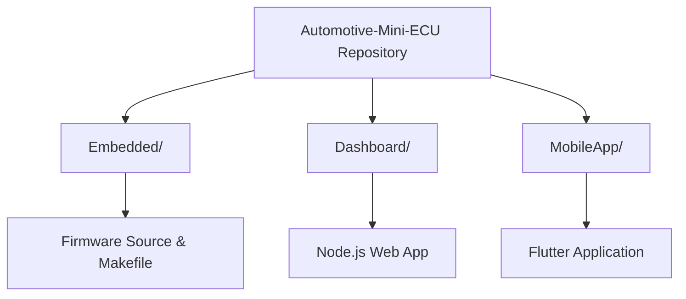
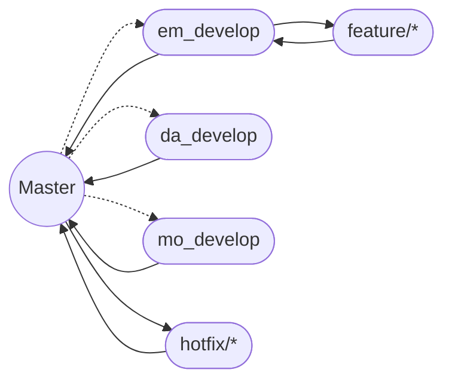

<div align="center">

![Gestell Company Logo][gestell-logo]

<br/><br/>

# 🌿 Git Workflow Guide

**Workflow**

_Developed by Gestell Company - Professional Embedded Solutions_

<br/>

    

</div>

---

<div align="center">


**Standard Branching Strategy & Conventions**

</div>

---

## 📋 Overview

This document explains the Git branching strategy and workflow for the **Automotive-Mini-ECU** project. 
To accommodate the multi-disciplinary nature of the project (Embedded, Dashboard, and Mobile), we utilize a **Single-Repository, Multi-Branch Architecture**. This approach streamlines CI/CD pipelines while allowing independent development cycles for each team.

---

## 🏗️ Repository Architecture

The project is structured into three primary domains within the same repository:



### 1. `Embedded/`
- **Team:** Embedded Team
- **Contents:** C/AVR Firmware, Unity Tests, and the dedicated `Makefile`.
- **Workflow:** Development on `em_develop` branch.

### 2. `Dashboard/`
- **Team:** Dashboard Team
- **Contents:** Frontend UI components and Node.js web applications.
- **Workflow:** Development on `da_develop` branch.

### 3. `MobileApp/`
- **Team:** Mobile Team
- **Contents:** Flutter/Dart mobile application.
- **Workflow:** Development on `mo_develop` branch.

---

## 🌿 Branching Strategy

We use a domain-isolated branching strategy to prevent conflicts between teams, with a unified production branch:



### Master Branch

#### `Master`
- **Purpose:** Production-ready code and releases.
- **Protection:** Protected, no direct commits. Requires Pull Request approval.
- **Merges from:** `em_develop`, `da_develop`, `mo_develop`, and `hotfix/*`.

### Development Branches

#### `em_develop`
- **Purpose:** Active development for the Embedded ECU.
- **Protection:** Protected, requires PR review.
- **Merges from:** Embedded `feature/*` branches.
- **Merges to:** `Master` (for releases).

#### `da_develop`
- **Purpose:** Active development for the Web Dashboard.
- **Protection:** Protected, requires PR review.
- **Merges from:** Dashboard `feature/*` branches.
- **Merges to:** `Master`.

#### `mo_develop`
- **Purpose:** Active development for the Mobile App.
- **Protection:** Protected, requires PR review.
- **Merges from:** Mobile `feature/*` branches.
- **Merges to:** `Master`.

### Supporting Branches

#### `feature/*`
- **Purpose:** New features and enhancements for a specific domain.
- **Naming:** `feature/<domain>-<feature-name>` (e.g., `feature/em-uart-driver`, `feature/da-login-ui`).
- **Branch from:** Respective domain branch (e.g., `em_develop`).
- **Merge to:** Respective domain branch.

#### `hotfix/*`
- **Purpose:** Critical production bug fixes.
- **Branch from:** `Master`.
- **Merge to:** `Master` AND all affected domain develop branches.

---

## ⚙️ CI/CD Integration (GitHub Actions)

Our CI/CD pipelines are highly optimized using path-filtering. They only trigger when code in a specific folder changes, preventing unnecessary builds.

### 1. Embedded CI (`embedded-ci.yml`)
- **Trigger:** Changes in `Embedded/**` pushed to `em_develop` or `Master`.
- **Actions:** Builds Docker image, runs `make build`, `make test`, `make coverage`, `make misra`, and `make size`.

### 2. Dashboard CI (`dashboard-ci.yml`)
- **Trigger:** Changes in `Dashboard/**` pushed to `da_develop` or `Master`.
- **Actions:** Builds Docker image, runs `npm install` and `npm test`.

### 3. Mobile CI (`mobile-ci.yml`)
- **Trigger:** Changes in `MobileApp/**` pushed to `mo_develop` or `Master`.
- **Actions:** Builds Docker image, runs `flutter pub get` and `flutter test`.

### 4. Release CI (`release.yml`)
- **Trigger:** Merges to `Master`.
- **Actions:** Runs full build and uploads production artifacts (e.g., `.hex` firmware) to the GitHub release page.

---

## 📝 Commit Message Guidelines

### Format
```
<type>(<scope>): <subject>
```

### Types
- **feat:** New feature
- **fix:** Bug fix
- **docs:** Documentation
- **style:** Formatting
- **refactor:** Code restructuring
- **test:** Adding tests
- **chore:** Tooling and configurations

### Examples
- `feat(embedded): Add UART driver for ATmega128`
- `fix(dashboard): Resolve login timeout issue`

---

## 🔀 Pull Request Guidelines

1. **Title:** `[DOMAIN] Brief description` (e.g., `[EMBEDDED] Add UART Driver`).
2. **Reviewers:** At least 1 reviewer from your specific team is required.
3. **CI/CD:** All GitHub Actions checks MUST pass (Green ✅) before merging.

---

## 💡 Quick Reference

| Action               | Command                             |
| -------------------- | ----------------------------------- |
| Create feature       | `git checkout -b feature/em-<name>` |
| Create hotfix        | `git checkout -b hotfix/<name>`     |
| Update from remote   | `git pull origin <branch>`          |
| Push branch          | `git push origin <branch>`          |
| Delete local branch  | `git branch -d <branch>`            |
| Delete remote branch | `git push origin --delete <branch>` |

---

<div align="center">

**Built with ❤️ by Gestell Team**

_Empowering the next generation of embedded systems engineers_

**Copyright © 2026 Gestell Company - All Rights Reserved**

</div>

[gestell-logo]: data:image/png;base64,iVBORw0KGgoAAAANSUhEUgAAAogAAAFkCAYAAACjJ8reAAAQAElEQVR4Aez9B4AfyVnnD3+rqtMvTFLO0krapLXXa6/Nkc8GDNj8wSb4gJfMwRmbYMBcDoT33gv8jclg8gF3xx0GvOaAM4bDhgMbh3VYb17tSqucNeEXOlXV+62ekVa7q6wZTdDT6qeru7q66qlP9fzqO0/NjDRkEwJCQAgIASEgBISAEBACFxAQgXgBDDkVAkJACKwcAtITISAEhMD1ExCBeP3s5EkhIASEgBAQAkJACKxIAiIQl/CwimtCQAgIASEgBISAEFgMAiIQF4O6tCkEhIAQEAK3MgHpuxBY8gREIC75IRIHhYAQEAJCQAgIASFwcwmIQLy5vKW1lUJA+iEEhIAQEAJCYAUTEIG4ggdXuiYEhIAQEAJCQAhcGwEpPUtABOIsBzkKASEgBISAEBACQkAIzBEQgTgHQhIhIARWCgHphxAQAkJACNwoARGIN0pQnhcCQkAICAEhIASEwAojsCQF4gpjLN0RAkJACAgBISAEhMCyIiACcVkNlzgrBISAEFjWBMR5ISAElgkBEYjLZKDETSEgBISAEBACQkAI3CwCIhBvFumV0o70QwgIASEgBISAEFjxBEQgrvghlg4KASEgBISAELgyASkhBC4kIALxQhpyLgSEgBAQAkJACAgBIQARiPISCIEVQ0A6IgSEgBAQAkJgfgiIQJwfjlKLEBACQkAICAEhIAQWhsAi1CoCcRGgS5NCQAgIASEgBISAEFjKBEQgLuXREd+EgBBYKQSkH0JACAiBZUVABOKyGi5xVggIASEgBISAEBACC09ABOLVMpZyQkAICAEhIASEgBC4RQiIQLxFBlq6KQSEgBAQAhcnILlCQAi8mIAIxBczkRwhIASEgBAQAkJACNzSBEQg3tLDv1I6L/0QAkJACAgBISAE5pOACMT5pCl1CQEhIASEgBAQAvNHQGpaNAIiEBcNvTQsBISAEBACQkAICIGlSUAE4tIcF/FKCKwUAtIPISAEhIAQWIYERCAuw0ETl4WAEBACQkAICAEhsJAEriwQF7J1qVsICAEhIASEgBAQAkJgyREQgbjkhkQcEgJCQAjcHALSihAQAkLgUgREIF6KjOQLASEgBISAEBACQuAWJSACcVkPvDgvBISAEBACQkAICIH5JyACcf6ZSo1CQAgIASEgBG6MgDwtBBaZgAjERR4AaV4ICAEhIASEgBG6MgDwtBBaZgAjERR4AaV4ICAEhIASEgBAQAkuNgAjEpTYi4s9KISD9EAJCQAgIASGwbAmIQFy2QyeOCwEhIASEgBAQAjefwK3RogjEW2OcpZdCQAgIASEgBISAELhqAiIQrxqVFBQCQmClEJB+CAEhIASEwOUJiEC8PB+5KwSEgBAQAkJACAiBW47AMhWIt9w4SYeFgBAQAkJACAgBIXDTCIhAvGmopSEhIASEgBC4IgEpIASEwJIgIAJxSQyDOCEEhIAQEAJCQAgIgaVDQATi0hmLleKJ9EMICAEhIASEgBBY5gREIC7zART3hYAQEAJCQAjcHALSyq1EQATirTTa0lchIASEgBAQAkJACFwFARGIVwFJigiBlUJA+iEEhIAQEAJC4GoIiEC8GkpSRggIASEgBISAEBACS5fAvHsmAnHekUqFQkAICAEhIASEgBBY3gREIC7v8RPvhYAQWCkEpB9CQAgIgSVEQATiEhoMcUUICAEhIASEgBAQAkuBgAjE+RsFqUkICAEhIASEgBAQAiuCgAjEFTGM0gkhIASEgBBYOAJSsxC49QiIQLz1xlx6LASEgBAQAkJACAiByxIQgXhZPHJzpRCQfggBISAEhIAQEAJXT0AE4tWzkpJCQAgIASEgBITA0iIg3iwQARGICwRWqhUCQkAICAEhIASEwHIlIAJxuY6c+C0EVgoB6YcQEAJCQAgsOQIiEJfckIhDQkAICAEhIASEgBBYXALzIRAXtwfSuhAQAkJACAgBISAEhMC8EhCBOK84pTIhIASEwEoiIH0RAkLgViUgAvFWHXnptxAQAkJACAgBISAELkFABOIlwKyUbOmHEBACQkAICAEhIASulYAIxGslJuWFgBC4PgKvRoTd2IM78Nbuq3DP9VUiTwkBITBHQBIhsKAERCAuKF6pXAjc4gQoClt78A/S3a2fMk+vf6xTv/wRM9j4i71TuP8WJyPdFwJCQAgsaQIiEJf08IhzK5rASu7cLqzDluifqX3rH9fVHX9fnOz8sPZrdw/6KWzVRpxCLYvu78F9AORzkhBkFwJC4NYiIB98t9Z4S2+FwMISuIeLyLfjl6N619Mp7v/PGG7aNZgaQWvsTsCOQquM7XtUdhkIxDvxdejt+KTZvecvcTu+kI7LLgSEgBC4KgIroZAIxJUwitIHIbDIBJJX4G5sz34vyW97EtO3fw+KkW6R50jiGD6vMexrVIWBLaehMrvI3l5d80al3x/pLmwvfk2KXX+t7sjeH9+Dl13d01JKCAgBIbC8CYhAXN7jJ94LgcUlsAcb4jvwi/b45k+o/ku+wU5vUVG9Htq1kZoW6qJE3G4jMW1EUQtIubasPOJscd2+Yus7sc3Um7+wHvAj0rVQnOnClHe81g22fxy78Ut4OdZesQ4pIASEgBBYxgT46beMvRfXhYAQWBwCn4NWfGf6NtMbe7g6s/6tpl6XJboF5RSSKOVycsJooUFsInhbwroCztVcYo7gpmZQVfCL4/hVtur0d5YzIzCqyz5FFLerYPtd+MH6yBR73pL1Nz1CofideDUiyCYEhIAQWIEE9ArsU9MlOQgBIbBABF6CV2Lfmr/F9P0/Y3u7VnfSO2CrjOYoCDUG/T60VjCRQk1xaBQotByoFOHKEsnEKqDC0t3uR7uV7HgL6hYizSXyuqSwpZ61EbQdgx2sRjW9cS0Gu34jPrLh/bgXW5ZuZ8QzISAEhMD1ERCBeH3c5CkhcOsR2IMEO/HPcWb8A5Ha8QpbxzAmRV6VQOSgaLUvELcUHPrwqkeh6OFRQ2lLc9DGw1FwYSlvZ/DFeT9bl3A5vLZ9xEkN76bB0CGUtzDKUOx6aJ+g6ndfg+mJT2AP3gTZbhYBaUcICIGbQEDfhDakCSEgBJY7gT3YZqp1fxnZPf/JuNu7tmhTLBmKv4hGvaQo/JSFU449tYCiaISlIATKsoAPwiqIwypHXRUwMZbslpjtb/FFxGXwChrsD/ul2Jdg4LX2dN3HUC6FcSNAvmqtGmz6fdyOnwajj7wruxAQAkJg2RMQgbjsh3AZdkBcXlYEonvxxeh3P2ynu19gwhJrGSOKElgbBCEllArm4BtxSAmlFDyllWe+dRpZq0OxxbLOQcUaaSvlcjSLLEUKd2NjOUxfp5MMiqIX7Ae8AjyjhuFcVYCiQnQtwHVgdAqgA11vAHq7fxCn1rwfO8ALyCYEhIAQWNYERCAu6+ET54XAAhPYhe+rD2fvjfz2TRprUExbpEmb4qiiSKRwaprnx4inNecUTwjGa4oqT4GYD0okWRuKGsvHBSo/Da46103xpXbw+LYsG4fLGT1kF4Kjsy5q9or9VTUcrcnzEcph0fyGtu1HiNRm6HL356XJto/hNsifw2kgyeFWIyD9XTkEmo/AldMd6YkQEALzQiD8du7O1k+rfMs7O6P3derJDowfRZQyGlgPqO8GFHwFm3KA19AhyobwccJrOP4zcD6FVzHaYxSWpUVVDzySyUdcNfU2DPDHWHqbQq2+Mp+ehkqSZikcKkQMK3iEvgWj+A15eshu51DaABTBUZzAM6Ia6wjFEbMFw3V/Ed2D1yy9LopHQkAICIGrIxA+8a6upJQSAkLgFiDALt6LTuvIjt9RvT0/qMqNcf+Mw+joevg6yKTw84U1lHJcNi6gKQU1NRN4xicB5nvv4Z2CUyVsdRg2edYjeuq9SB//Iuw4eh8O4edwEj0svc2j678C40+/TaUH98edGThdIPSJBziwtwrwjCB6ZZnlEccxysEAxhjYokT44+Dd1duBYvva+vTG/4Ut+GrIJgSEgBBYhgREIC7DQROXhcBCEVjzeRjJqi2/PzyBb4wx+6/damHQn0Q9OMOIWYk0jdi8hm5+08RBgYIx/BKHd2BYrbnnFT9azHQdrT/8B4V+5uU4fvyNOJR/EB9kYSzh7VOYxFPVz7nOkZdW7qnvhx6edj6BozAE2L/G2Dcun4Om2E9FkVj0+uh224i1Rp8RyDjSpDfe0Wbkd7ADb4BsQkAICIHFJnCN7fOT7hqfkOJCQAisTAL3o33qyPjv5WdHXp+2N7GPFIEUPIOZKaSZQWd1F0XZpw0pFE1zn3FChAhbWGH2ikvLKoeLJ61PDnzIp099Qf043oQn8Wkst+1RRjgP4RdsdniPTQ78oo9OV94M0PSxiSSGj06Nqqqa6GF7JEVvZhKRMUi5PG1UBG/bjCRu7MK3/yt246sgmxAQAkJgGREIn3LLyF1xVQgIgQUhEP7G4YmxX4+x9itgFRQi1BVgPQVqGocvSHBaIkg9IRbJ4jzmLetzCxgatrmJaC6U5PwT31Nhw+9IXYj7/Hct+exgkcPPt9Ltn7WpcefwhJDapCikIyUp5iMPx3ggWsG5KHR14Oee5pmgwTikTyspuprNf/Lu7C594gDnlcCAgBIXDTCOib1pI0JASEwNIlMG1+Kla7vrGa4fIxo1/5MAieGFobiiGD2tfojrRRWyCOMkRcTi1mziJpJSjz01CdaVT+8Q/U9sB9OIZfZEdZkseVsu/HXyM+9gUOT/wKOpPWVlPwXC0fzsyg3e4giiiaa4duZxTOanKLYHSKLB2Fz9vQdusozk78Ae7HtpWCRPohBITAyiagV3b3lljvxB0hsAQJ6Dvww1pv+55qcoCsNYFYZ4hjD1cPkQ8d4GN67TEY9BGZNvKzM6i51JyMZhSHAyDLC6/3/ig+q/9a7Oc/rNBtL6ZxsHgL0n3fHo8OBg4FWuMdDIoc/dNDRPEEhsThnIb3HjmjrMPpAUyUIURYo9bmjdlg5/txD1atUELSLSEgBFYQARGIK2gwpStC4JoJ3I2vcJNrfkL7VVHUXg1bxvAuoSjUqLlsDDiMjHZYbQVjFBz1Yjy+BuB5WZ4C0sNT6epn34j9+Am8GxYrf/PYi/9amX2vQXLw4LBi9FRrJBPjZOOgGUn0hNTtZtD8dE07HcSGArtyqKcoGqdW34mzyW+sfEy3Xg+lx0JgpRHgR9hK65L0RwgIgasicBu2Y7L7WzrZ2Kn7EaOCMSNdKeohI2AUiZ1OF0nmcfrMIUbHNCouOzvnoZQCGCEz7ZmD6J78/OIhvO+q2ltJhZ7ER7N1Zz4/6eSf8BTRzgxg1TTK4gxM5nDm7BHEqUNBZmVRY3RiLZgBkF/S3vFG7ML3ryQc0hchIARWHgG98rokPRIC10PgFntmDxITr/rvOtqw1tuMArCNTmeEus8iaafNf6NXFAVCFMwkEfM90pEuQoSsHDBymBz7tMWpz8NjePgWI3e+u/mDOFD6Z16H7MDf1MVJqEghG8nIqoZOW7w5rwAAEABJREFUAKWZxoqRV4Pp05MwKkGkIpTTFNjlxv+Au/BSyCYEhIAQWKIERCAu0YERt4TAghIo8S/sTOezI9OCnz4DhRr9/mk4NwWjB0iz2daLCryXwdYWzf+9bC2XlXsPdtccfy2exkHc6tvTOLFq04mvRGvwPkc0RcV4oqugTY286nF5WUEx2pqmXXgboR5UyNIJGDvRjezI/8RupLc6Qum/EFhwAtLAdREQgXhd2OQhIbCMCezGy5Gv+afKTeiy55CtWsuol4XWPG8Z5MUUPCpUlhFERr20YThMR7C6B9U58hDWPvX63idxchkTmFfXz3wE0+ie+iYkpz7mVR+IDHQUQynVcK2qiucGyilk3Rbyfg5bkGe++m4d4V/NqzNSmRAQAkJgngjoeapHqhECQmA5ENiBDMXaX4vd+q72CZJ4FHkviMMIxpgmSqi1RlENkWQxhQ2lYmW5fBoD8eTTvv3Ul+MhnLjJXV36zT2CM0gOf43J+s/CK1QlXSZf7y0iLj2H6CuxwlYD6kePSDFwWI7CDTb+M9yDPSwtuxAQAkJgSRHQS8obcUYICIGFJvA29De8wpcdoI5R9isuJ7dR5hbhl5YVEqRph3kZr0vUXDc1aQlvnj3toyNfhcdwdKEdXLb178Uh3Tr0jxCdGXpFERi3waAhGDoEYdMcDRTdBoCBsm1EbnOGqexdzJBdCAgBIbCkCOib4o00IgSEwOITeBU2wE780yQbV5EeAXyK7vh4EzVkiBDtbAJlYTDoh6ih45KzRhzHqHF8iIkTX4u9eBSyXZZA9Wj1UaT7fyBKa1TDoinrVA0EAzcyD9xVEIgqhqs70Gb7F+BOvAmyCQEhIASWEAERiEtoMMQVIbCgBCbxY0atWz0bLXTNkvJgkKMeDmEih2E+DWUU2p1ReGcYPWQE0TBgGB38F/gM/npBfVtJle/Db9Q49j+S0TisNlOIR+zdiz9qlVJwQ4fIrwbyVT+B+xGz4LLbxWEhIARWJoEXf2qtzH5Kr4TArU1gN3ap8rZvs/20iQp6lICyFC8G7bExJFkBr88ytRgMpykQFbIRD588/afYj5+DbNdCwGN45gfL+tiB8JBHCocIYbnZqQpOF7SKt2rEacRl/hooV9+VlEaiiKQiuxAQAkuDgAjEpTEOi+iFNH1LEKjNv/P5eKZNp+luFAO1HcC5EkXZx7A/hThRsDYIxxKtsQj5YO9pjODNzQNyuDYCJ3Ac2cF/7qMhlPLnn/WgKIc7f20dhaIygB9DOdP617zBCx5lFwJCQAgsMgERiIs8ANK8EFhwAnuwDeh+A+CQpimqokD4b/RSRq/SlqcwpAc6g7Mx6qJGqxthWO4HRsofxqdxmHdlvx4Cr8C7ER//E29yLjWXNApDrxmdpTr3Mbw3SIxGZCgga4s4Gt+DPfgKyCYE5ouA1CMEboCACMQbgCePCoFlQaDGD6JuJfAOdWmhowhJQhGY91EzYlgxDxQssenCZAmGxRGoztH/gyfxO5Dt+gm8G9Ynkz/ik+Pem5r1hI/bYIByHprjURZDhJBhK+ugmvFAgR+BbEJACAiBJUBg9tNqCTgiLggBIfAiAjeecRdWq3zLP9ZuFIZLmc6BwkSjqiwjVinXmQ0itKDRQfNnbjSXPFuT8BH+KWS7cQJP4AndPvwL3k7BMWIYRRrKV2TdQ5ZppAnloXWohjnHZxV0sfULsIP/IJsQEAJCYHEJ6MVtXloXAkJgQQkU3W/Q1dpR5dKmGe2bBEopn件。
