# 🚗 Gestell Automotive Mini-ECU — Complete UML Diagrams (Embedded Part)

> **Project:** Gestell Automotive Mini-ECU  
> **MCU:** ATmega128 AVR @ 16 MHz  
> **Architecture:** AUTOSAR-Inspired 4-Layer (MCAL → HAL → OS → APP)  
> **Document:** Full System UML Reference  

---

## 📋 Table of Contents

1. [System Context Diagram](#1-system-context-diagram)
2. [Package / Component Diagram](#2-package--component-diagram)
3. [Class Diagram — Full System](#3-class-diagram--full-system)
4. [ECU Finite State Machine (State Diagram)](#4-ecu-finite-state-machine-state-diagram)
5. [Sequence Diagram — Boot & Self-Test](#5-sequence-diagram--boot--self-test)
6. [Sequence Diagram — RUN Mode Normal Operation](#6-sequence-diagram--run-mode-normal-operation)
7. [Sequence Diagram — Fault Detection & SAFE MODE](#7-sequence-diagram--fault-detection--safe-mode)
8. [Sequence Diagram — Bluetooth Command Processing](#8-sequence-diagram--bluetooth-command-processing)
9. [Sequence Diagram — WiFi Telemetry Broadcast](#9-sequence-diagram--wifi-telemetry-broadcast)
10. [Activity Diagram — Main Scheduler Loop](#10-activity-diagram--main-scheduler-loop)
11. [Activity Diagram — Fault Detection Pipeline](#11-activity-diagram--fault-detection-pipeline)
12. [Communication / Deployment Diagram](#12-communication--deployment-diagram)
13. [Data Flow Diagram (DFD)](#13-data-flow-diagram-dfd)
14. [Layer Dependency Diagram](#14-layer-dependency-diagram)
15. [Timing Diagram — Periodic Tasks](#15-timing-diagram--periodic-tasks)

---

## 1. System Context Diagram

> Shows the complete ECU system and all external actors/interfaces.

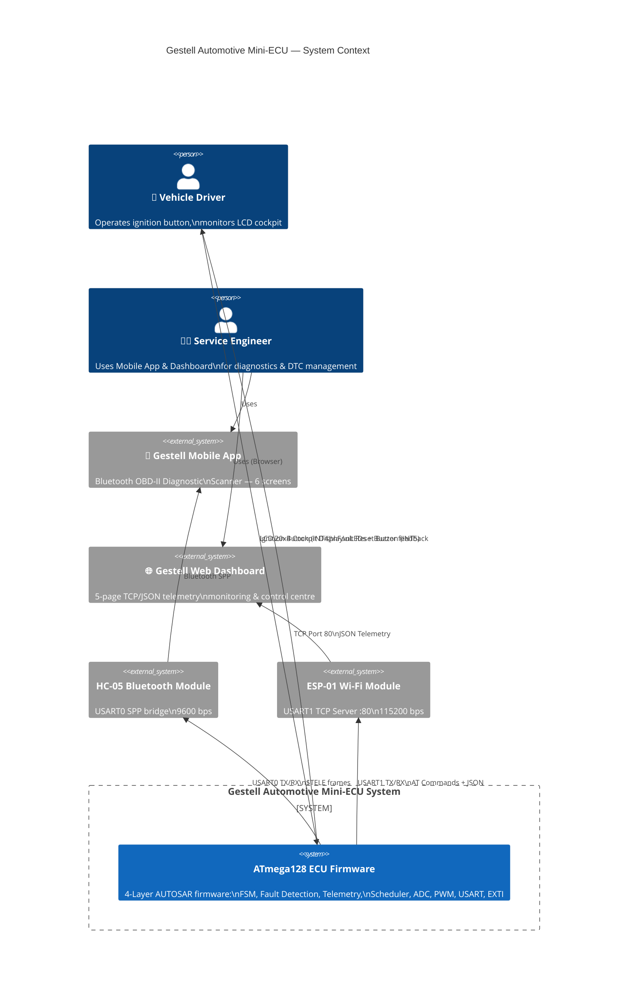

---

## 2. Package / Component Diagram

> Shows all firmware layers, modules, and their dependencies.

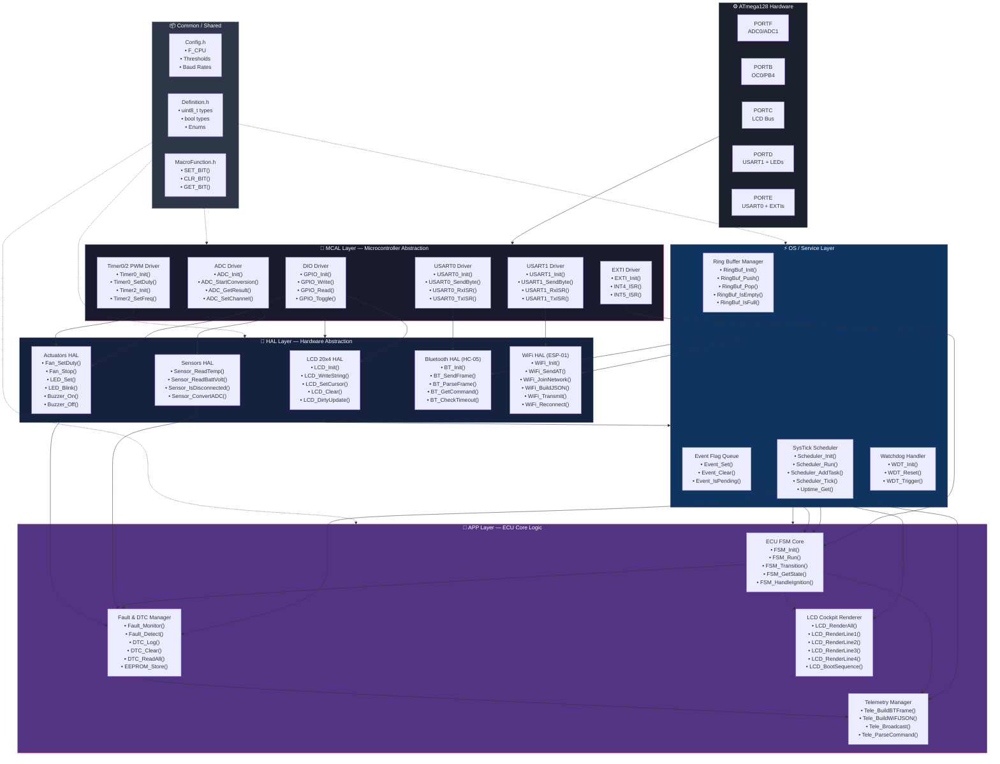

---

## 3. Class Diagram — Full System

> Full system class diagram showing all modules, data structures, and relationships.

```mermaid
classDiagram
    direction TB

    %% ─── COMMON ────────────────────────────────────────────────
    class Config {
        <<header>>
        +F_CPU : uint32_t = 16000000
        +TEMP_MAX : uint8_t = 90
        +TEMP_MIN : uint8_t = 40
        +TEMP_HYSTERESIS : uint8_t = 75
        +BATT_MIN_V : float = 10.5
        +BATT_MAX_V : float = 16.0
        +BATT_NOM_LOW : float = 12.0
        +BATT_NOM_HIGH : float = 14.5
        +USART0_BAUD : uint32_t = 9600
        +USART1_BAUD : uint32_t = 115200
        +ADC_PRESCALER : uint8_t = 128
        +SCHEDULER_TICK_MS : uint8_t = 10
        +COMMS_TIMEOUT_S : uint8_t = 10
        +RING_BUF_SIZE : uint8_t = 64
        +DTC_MAX_STORED : uint8_t = 16
        +WIFI_RETRY_MAX : uint8_t = 3
    }

    class Definition {
        <<header>>
        <<typedef>> uint8_t
        <<typedef>> uint16_t
        <<typedef>> uint32_t
        <<typedef>> int8_t
        <<typedef>> bool
        <<enum>> ECU_State_t
        <<enum>> DTC_Code_t
        <<enum>> LED_ID_t
        <<enum>> BT_Command_t
        <<enum>> Sensor_ID_t
    }

    class ECU_State_t {
        <<enumeration>>
        STATE_OFF = 0
        STATE_START = 1
        STATE_RUN = 2
        STATE_DIAGNOSTIC = 3
        STATE_FAULT = 4
        STATE_SAFE_MODE = 5
    }

    class DTC_Code_t {
        <<enumeration>>
        DTC_NONE = 0x00
        DTC_F001_OVER_TEMP = 0x01
        DTC_F002_BATT_VOLT = 0x02
        DTC_F003_SENSOR_DISC = 0x03
        DTC_F004_COMMS_TIMEOUT = 0x04
        DTC_F005_PWM_FEEDBACK = 0x05
    }

    class LED_ID_t {
        <<enumeration>>
        LED_POWER_GREEN = 0
        LED_STATUS_BLUE = 1
        LED_WARNING_YELLOW = 2
    }

    class BT_Command_t {
        <<enumeration>>
        CMD_NONE = 0
        CMD_IGN_START = 1
        CMD_IGN_STOP = 2
        CMD_READ_DTC = 3
        CMD_CLEAR_DTC = 4
        CMD_DIAG_REQ = 5
    }

    %% ─── MCAL Layer ─────────────────────────────────────────────
    class DIO_Driver {
        <<module>>
        -DDRA : register
        -DDRB : register
        -DDRC : register
        -DDRD : register
        -DDRE : register
        -DDRF : register
        +DIO_Init(port, pin, direction) void
        +DIO_WritePin(port, pin, value) void
        +DIO_ReadPin(port, pin) uint8_t
        +DIO_TogglePin(port, pin) void
        +DIO_WritePort(port, value) void
        +DIO_ReadPort(port) uint8_t
    }

    class ADC_Driver {
        <<module>>
        -ADMUX : register
        -ADCSRA : register
        -ADCL : register
        -ADCH : register
        +ADC_Init() void
        +ADC_SetChannel(channel) void
        +ADC_StartConversion() void
        +ADC_GetResult() uint16_t
        +ADC_ReadBlocking(channel) uint16_t
    }

    class Timer0_Driver {
        <<module>>
        -TCCR0 : register
        -OCR0 : register
        -TCNT0 : register
        +Timer0_Init_FastPWM() void
        +Timer0_SetDutyCycle(ocr_value) void
        +Timer0_Stop() void
        +Timer0_GetDuty() uint8_t
    }

    class Timer2_Driver {
        <<module>>
        -TCCR2 : register
        -OCR2 : register
        +Timer2_Init_SysTick() void
        +Timer2_ISR() void
        +Timer2_GetTick() uint32_t
    }

    class USART0_Driver {
        <<module>>
        -UBRRH0 : register = 0x00
        -UBRRL0 : register = 0x67
        -UCSR0B : register = 0xD8
        -UCSR0C : register = 0x86
        -rxBuffer : RingBuffer_t
        -txBuffer : RingBuffer_t
        +USART0_Init() void
        +USART0_SendByte(data) void
        +USART0_SendString(str) void
        +USART0_ReceiveByte() uint8_t
        +USART0_DataAvailable() bool
        +ISR_USART0_RX() void
        +ISR_USART0_TX() void
    }

    class USART1_Driver {
        <<module>>
        -UBRRH1 : register = 0x00
        -UBRRL1 : register = 0x08
        -UCSR1B : register = 0xD8
        -rxBuffer : RingBuffer_t
        -txBuffer : RingBuffer_t
        +USART1_Init() void
        +USART1_SendByte(data) void
        +USART1_SendString(str) void
        +USART1_ReceiveByte() uint8_t
        +USART1_DataAvailable() bool
        +ISR_USART1_RX() void
        +ISR_USART1_TX() void
    }

    class EXTI_Driver {
        <<module>>
        -EICRB : register
        -EIMSK : register
        -ignitionFlag : volatile bool
        -resetFlag : volatile bool
        +EXTI_Init() void
        +EXTI_Enable(int_id) void
        +EXTI_Disable(int_id) void
        +ISR_INT4_Ignition() void
        +ISR_INT5_FaultReset() void
        +EXTI_GetIgnitionFlag() bool
        +EXTI_GetResetFlag() bool
        +EXTI_ClearFlags() void
    }

    %% ─── HAL Layer ─────────────────────────────────────────────
    class LCD_HAL {
        <<module>>
        -RS_PIN : PC0
        -EN_PIN : PC2
        -D4_PIN : PC4 .. PC7
        -dirtyFlags : uint8_t[4]
        -lineCache : char[4][21]
        +LCD_Init() void
        +LCD_Clear() void
        +LCD_SetCursor(row, col) void
        +LCD_WriteChar(c) void
        +LCD_WriteString(str) void
        +LCD_WriteCommand(cmd) void
        +LCD_WriteNibble(nibble) void
        +LCD_EnablePulse() void
        +LCD_UpdateDirtyLines() void
        +LCD_SetDirty(line) void
    }

    class Sensors_HAL {
        <<module>>
        -ADC_CH_TEMP : uint8_t = 0
        -ADC_CH_BATT : uint8_t = 1
        -lastTempRaw : uint16_t
        -lastBattRaw : uint16_t
        -discCount : uint8_t[2]
        +Sensor_Init() void
        +Sensor_ReadTemperature() float
        +Sensor_ReadBatteryVoltage() float
        +Sensor_ConvertTempADC(raw) float
        +Sensor_ConvertBattADC(raw) float
        +Sensor_IsDisconnected(ch) bool
        +Sensor_GetLastTemp() float
        +Sensor_GetLastBatt() float
    }

    class Actuators_HAL {
        <<module>>
        -FAN_PIN : PB4
        -LED_PWR : PD4
        -LED_STS : PD5
        -LED_WRN : PD6
        -BUZZER : PD7
        -fanDuty : uint8_t
        -buzzerActive : bool
        +Actuators_Init() void
        +Fan_SetDuty(percent) void
        +Fan_Stop() void
        +Fan_GetDuty() uint8_t
        +LED_Set(id, state) void
        +LED_Blink(id, freq_hz) void
        +LED_StopBlink(id) void
        +Buzzer_On(freq_hz) void
        +Buzzer_Off() void
        +Actuators_EmergencyCutoff() void
    }

    class BT_HAL {
        <<module>>
        -frameBuffer : char[128]
        -rxState : uint8_t
        -lastRxTime : uint32_t
        -connected : bool
        +BT_Init() void
        +BT_SendTelemetryFrame(temp, batt, pwm, dtc) void
        +BT_SendDTCReport(dtcList) void
        +BT_SendDiagReport(report) void
        +BT_ParseIncomingByte(byte) BT_Command_t
        +BT_GetParsedCommand() BT_Command_t
        +BT_GetCommandParam() char*
        +BT_ComputeXORChecksum(frame) uint8_t
        +BT_IsConnected() bool
        +BT_CheckTimeout() bool
    }

    class WiFi_HAL {
        <<module>>
        -atBuffer : char[256]
        -jsonBuffer : char[512]
        -retryCount : uint8_t
        -connected : bool
        -tcpClient : uint8_t
        +WiFi_Init() void
        +WiFi_SendAT(cmd) bool
        +WiFi_WaitResponse(expected, timeout_ms) bool
        +WiFi_JoinNetwork(ssid, pass) bool
        +WiFi_StartTCPServer(port) bool
        +WiFi_BuildJSONPayload(data) void
        +WiFi_TransmitJSON() void
        +WiFi_Reconnect() bool
        +WiFi_IsConnected() bool
        +WiFi_CheckTimeout() bool
        +WiFi_ParseIncomingAT() void
    }

    %% ─── OS Layer ───────────────────────────────────────────────
    class RingBuffer_t {
        <<struct>>
        +buffer : uint8_t[64]
        +head : uint8_t
        +tail : uint8_t
        +count : uint8_t
        +capacity : uint8_t
    }

    class SchedulerTask_t {
        <<struct>>
        +taskFunc : FuncPtr
        +periodMs : uint16_t
        +lastRunMs : uint32_t
        +enabled : bool
        +name : char[16]
    }

    class Scheduler {
        <<module>>
        -taskList : SchedulerTask_t[8]
        -taskCount : uint8_t
        -sysTick_ms : uint32_t
        -uptimeSeconds : uint32_t
        +Scheduler_Init() void
        +Scheduler_AddTask(func, period_ms, name) void
        +Scheduler_Run() void
        +Scheduler_Tick_ISR() void
        +Scheduler_GetUptime_ms() uint32_t
        +Scheduler_GetUptime_s() uint32_t
        +Scheduler_EnableTask(name) void
        +Scheduler_DisableTask(name) void
    }

    class EventQueue {
        <<module>>
        -ignitionEvent : volatile bool
        -resetEvent : volatile bool
        -diagReqEvent : volatile bool
        -btCmdEvent : volatile bool
        -wifiCmdEvent : volatile bool
        +Event_SetIgnition() void
        +Event_SetReset() void
        +Event_SetDiagReq() void
        +Event_GetIgnition() bool
        +Event_GetReset() bool
        +Event_GetDiagReq() bool
        +Event_ClearAll() void
    }

    class WatchdogHandler {
        <<module>>
        +WDT_Enable(timeout_ms) void
        +WDT_Reset() void
        +WDT_Disable() void
        +WDT_ISR() void
    }

    %% ─── APP Layer ──────────────────────────────────────────────
    class ECUData_t {
        <<struct>>
        +state : ECU_State_t
        +ignitionOn : bool
        +tempC : float
        +battV : float
        +fanPwmPct : uint8_t
        +activeDTC : DTC_Code_t
        +dtcList : DTC_Code_t[16]
        +dtcCount : uint8_t
        +btConnected : bool
        +wifiConnected : bool
        +uptimeSeconds : uint32_t
        +lastBtRxTime : uint32_t
        +lastWifiRxTime : uint32_t
    }

    class FSM_Core {
        <<module>>
        -ecuData : ECUData_t
        -currentState : ECU_State_t
        -prevState : ECU_State_t
        +FSM_Init() void
        +FSM_Run() void
        +FSM_Transition(newState) void
        +FSM_GetState() ECU_State_t
        +FSM_HandleIgnitionON() void
        +FSM_HandleIgnitionOFF() void
        +FSM_RunSelfTest() bool
        +FSM_EnterRUN() void
        +FSM_EnterFAULT() void
        +FSM_EnterSafeMode() void
        +FSM_EnterDiagnostic() void
        +FSM_HandleStateOFF() void
        +FSM_HandleStateSTART() void
        +FSM_HandleStateRUN() void
        +FSM_HandleStateDIAG() void
        +FSM_HandleStateFAULT() void
        +FSM_HandleStateSAFEMODE() void
    }

    class FaultManager {
        <<module>>
        -faultActive : bool
        -activeDTC : DTC_Code_t
        -sensorDiscCount : uint8_t[2]
        -btTimeoutCounter : uint16_t
        -wifiTimeoutCounter : uint16_t
        +Fault_Init() void
        +Fault_Monitor() void
        +Fault_CheckOverTemp(temp) bool
        +Fault_CheckBattVolt(volt) bool
        +Fault_CheckSensorDisc(ch) bool
        +Fault_CheckCommsTimeout() bool
        +Fault_TriggerFault(dtc) void
        +Fault_IsFaultActive() bool
        +Fault_GetActiveDTC() DTC_Code_t
        +Fault_ClearFault(dtc) bool
        +Fault_ExecuteFailSafe() void
    }

    class DTC_Manager {
        <<module>>
        -eepromDTCLog : DTC_Record_t[16]
        -dtcCount : uint8_t
        +DTC_Log(code, timestamp) void
        +DTC_Clear(code) bool
        +DTC_ClearAll() void
        +DTC_GetAll(outList) uint8_t
        +DTC_GetCount() uint8_t
        +DTC_IsStored(code) bool
        +DTC_LoadFromEEPROM() void
        +DTC_SaveToEEPROM() void
        +DTC_GetDescription(code) char*
    }

    class DTC_Record_t {
        <<struct>>
        +code : DTC_Code_t
        +timestamp_s : uint32_t
        +severity : uint8_t
        +cleared : bool
    }

    class TelemetryManager {
        <<module>>
        -btFrameBuffer : char[128]
        -jsonBuffer : char[512]
        -lastBroadcastTime : uint32_t
        +Tele_Init() void
        +Tele_Task_500ms() void
        +Tele_BuildBTFrame(data, outFrame) void
        +Tele_BuildWiFiJSON(data, outJSON) void
        +Tele_BroadcastBT(data) void
        +Tele_BroadcastWiFi(data) void
        +Tele_ParseBTCommand(frame) BT_Command_t
        +Tele_ParseWiFiCommand(frame) BT_Command_t
        +Tele_ExecuteCommand(cmd, param) void
    }

    class LCD_Renderer {
        <<module>>
        -line1 : char[21]
        -line2 : char[21]
        -line3 : char[21]
        -line4 : char[21]
        +LCD_RenderTask_200ms() void
        +LCD_RenderLine1_State(state, ignition) void
        +LCD_RenderLine2_Sensors(temp, batt) void
        +LCD_RenderLine3_Actuators(pwm, dtc) void
        +LCD_RenderLine4_Comms(btOk, wifiOk) void
        +LCD_BootSequence() void
        +LCD_ShowFaultScreen(dtc) void
    }

    %% ─── Relationships ──────────────────────────────────────────
    %% MCAL uses hardware
    DIO_Driver --> Definition
    ADC_Driver --> Definition
    Timer0_Driver --> Definition
    USART0_Driver --> RingBuffer_t
    USART1_Driver --> RingBuffer_t
    EXTI_Driver --> EventQueue

    %% HAL uses MCAL
    LCD_HAL --> DIO_Driver
    Sensors_HAL --> ADC_Driver
    Actuators_HAL --> DIO_Driver
    Actuators_HAL --> Timer0_Driver
    BT_HAL --> USART0_Driver
    WiFi_HAL --> USART1_Driver

    %% OS uses HAL
    Scheduler --> Timer2_Driver
    Scheduler "1" *-- "0..8" SchedulerTask_t

    %% APP uses OS + HAL
    FSM_Core --> Scheduler
    FSM_Core --> EventQueue
    FSM_Core --> Sensors_HAL
    FSM_Core --> Actuators_HAL
    FSM_Core --> FaultManager
    FSM_Core --> TelemetryManager
    FSM_Core --> LCD_Renderer
    FSM_Core "1" *-- "1" ECUData_t

    FaultManager --> Sensors_HAL
    FaultManager --> Actuators_HAL
    FaultManager --> DTC_Manager
    FaultManager --> ECUData_t

    DTC_Manager "1" *-- "0..16" DTC_Record_t

    TelemetryManager --> BT_HAL
    TelemetryManager --> WiFi_HAL
    TelemetryManager --> ECUData_t

    LCD_Renderer --> LCD_HAL
    LCD_Renderer --> ECUData_t

    ECU_State_t --> Definition
    DTC_Code_t --> Definition
    LED_ID_t --> Definition
    BT_Command_t --> Definition
```

---

## 4. ECU Finite State Machine (State Diagram)

> Formal UML State Machine with all states, transitions, guards, entry/exit actions.

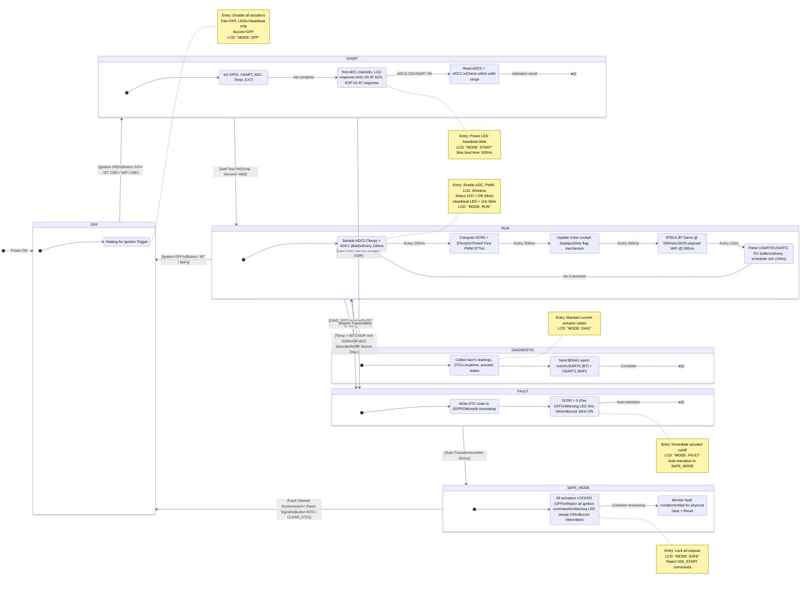

---

## 5. Sequence Diagram — Boot & Self-Test

> Detailed startup sequence from power-on to RUN state.

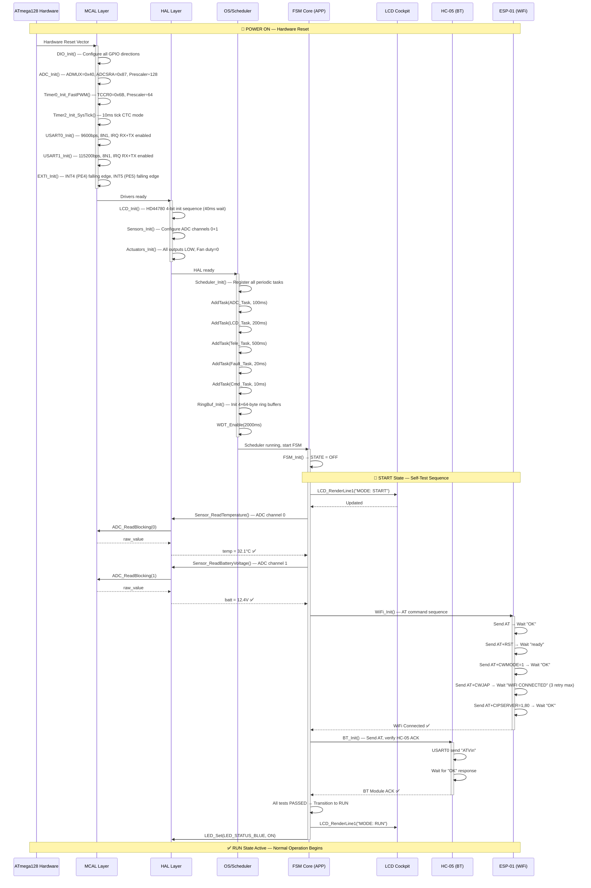

---

## 6. Sequence Diagram — RUN Mode Normal Operation

> One complete scheduler cycle during normal RUN mode (every 500ms window).

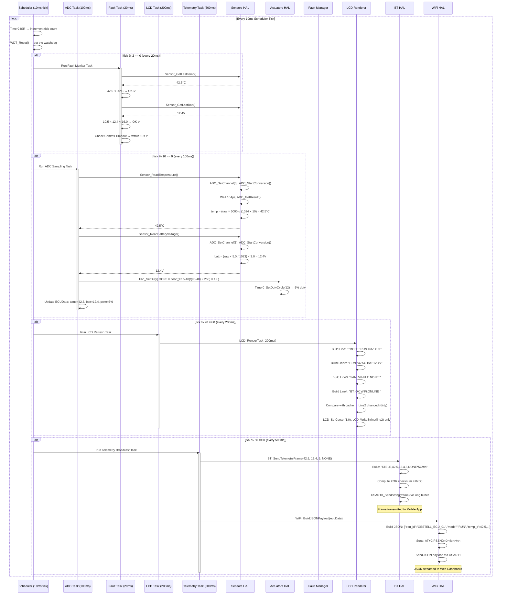

---

## 7. Sequence Diagram — Fault Detection & SAFE MODE

> Complete fault detection, DTC logging, emergency cutoff, and recovery sequence.

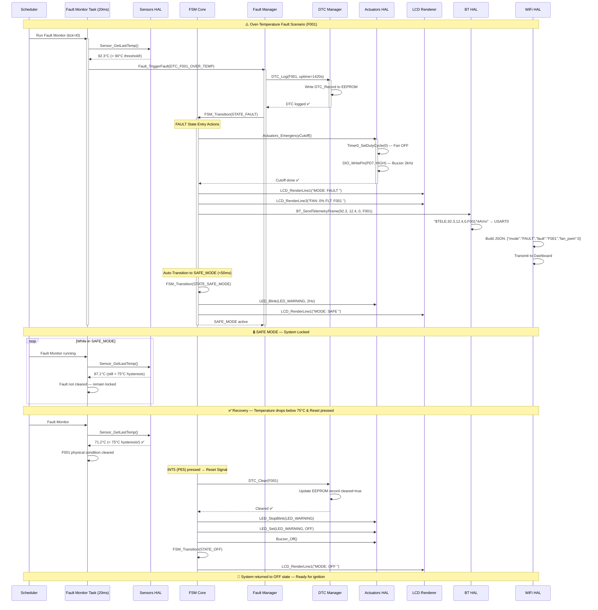

---

## 8. Sequence Diagram — Bluetooth Command Processing

> Full BT frame reception, parsing, and command execution flow.

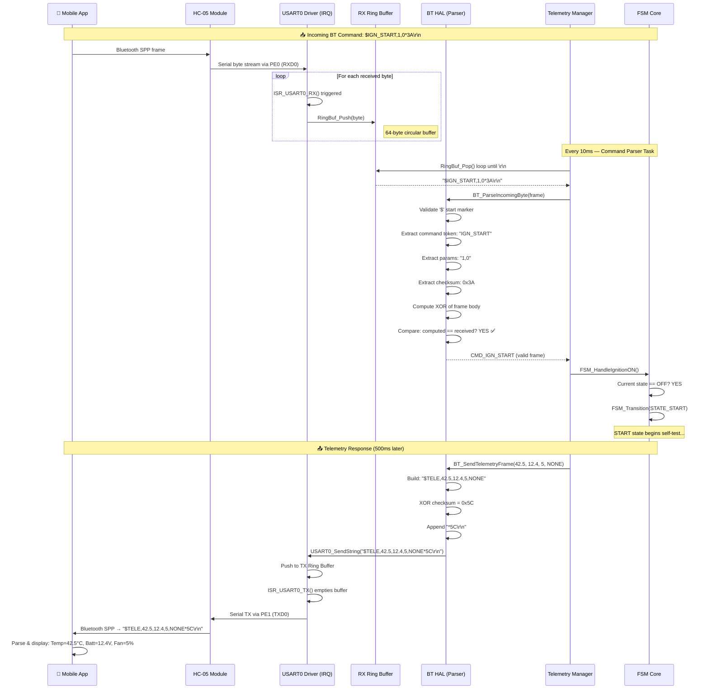

---

## 9. Sequence Diagram — WiFi Telemetry Broadcast

> ESP-01 AT initialization and JSON telemetry broadcast to Web Dashboard.

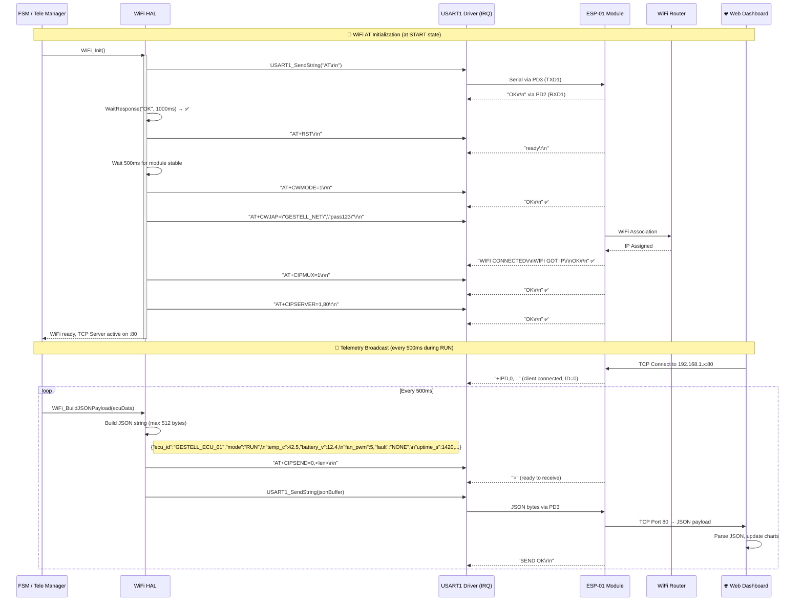

---

## 10. Activity Diagram — Main Scheduler Loop

> Complete activity flow of the cooperative scheduler main loop.

```mermaid
flowchart TD
    START(["🔌 Power ON"]) --> INIT["Initialize All Layers\nMCAL → HAL → OS → APP\nMax 500ms"]

    INIT --> FSM_INIT["FSM_Init()\nState = OFF"]

    FSM_INIT --> ENABLE_IRQ["Enable Global Interrupts\nsei()"]

    ENABLE_IRQ --> MAIN_LOOP(["🔄 Main Loop Entry"])

    MAIN_LOOP --> CHECK_TICK{Timer2 ISR\nFired? (10ms)}

    CHECK_TICK -- No --> WFI["Wait for Interrupt\nwfi / nop"]
    WFI --> CHECK_TICK

    CHECK_TICK -- Yes --> WDT_RESET["WDT_Reset()\nPet the watchdog"]

    WDT_RESET --> INC_TICK["tick_counter++\nuptime_ms += 10"]

    INC_TICK --> TASK_10MS["Run CMD Parser Task\n(Every 10ms)\nParse USART0+USART1 RX buffers"]

    TASK_10MS --> CHECK_20MS{tick % 2 == 0?\n(20ms)}
    CHECK_20MS -- No --> CHECK_100MS
    CHECK_20MS -- Yes --> FAULT_TASK["Run Fault Monitor Task\n(Every 20ms)\nCheck Temp, Batt, Sensor, Comms"]

    FAULT_TASK --> FAULT_DET{Fault\nDetected?}
    FAULT_DET -- Yes --> FAULT_TRIGGER["Fault_TriggerFault(dtc)\nLog DTC, Cut Actuators\nTransition FAULT→SAFE_MODE"]
    FAULT_DET -- No --> CHECK_100MS

    FAULT_TRIGGER --> CHECK_100MS

    CHECK_100MS{tick % 10 == 0?\n(100ms)} -- No --> CHECK_200MS
    CHECK_100MS -- Yes --> ADC_TASK["Run ADC Sampling Task\n(Every 100ms)\nRead Temp + Batt, Update ECUData\nCompute Fan PWM OCR0"]

    ADC_TASK --> CHECK_200MS{tick % 20 == 0?\n(200ms)}
    CHECK_200MS -- No --> CHECK_500MS
    CHECK_200MS -- Yes --> LCD_TASK["Run LCD Refresh Task\n(Every 200ms)\nBuild 4 lines, dirty-flag update"]

    LCD_TASK --> CHECK_500MS{tick % 50 == 0?\n(500ms)}
    CHECK_500MS -- No --> CHECK_EVENTS
    CHECK_500MS -- Yes --> TELE_TASK["Run Telemetry Task\n(Every 500ms)\nBuild + Send BT $TELE frame\nBuild + Send WiFi JSON payload"]

    TELE_TASK --> CHECK_EVENTS["Check Event Flags\n(from ISRs)"]

    CHECK_EVENTS --> IGN_EVT{Ignition\nEvent?}
    IGN_EVT -- Yes --> HANDLE_IGN["FSM_HandleIgnitionON/OFF()\nSet/Clear ignitionEvent flag"]
    IGN_EVT -- No --> RST_EVT

    HANDLE_IGN --> RST_EVT{Reset\nEvent?}
    RST_EVT -- Yes --> HANDLE_RST["FSM_HandleFaultReset()\nIf fault cleared → transition OFF"]
    RST_EVT -- No --> FSM_RUN

    HANDLE_RST --> FSM_RUN["FSM_Run()\nExecute current state handler"]

    FSM_RUN --> MAIN_LOOP

    style FAULT_TRIGGER fill:#e53e3e,color:#fff
    style FAULT_TASK fill:#dd6b20,color:#fff
    style ADC_TASK fill:#2d6a4f,color:#fff
    style LCD_TASK fill:#1a365d,color:#fff
    style TELE_TASK fill:#44337a,color:#fff
```

---

## 11. Activity Diagram — Fault Detection Pipeline

> Detailed fault detection decision logic evaluated every 20ms.

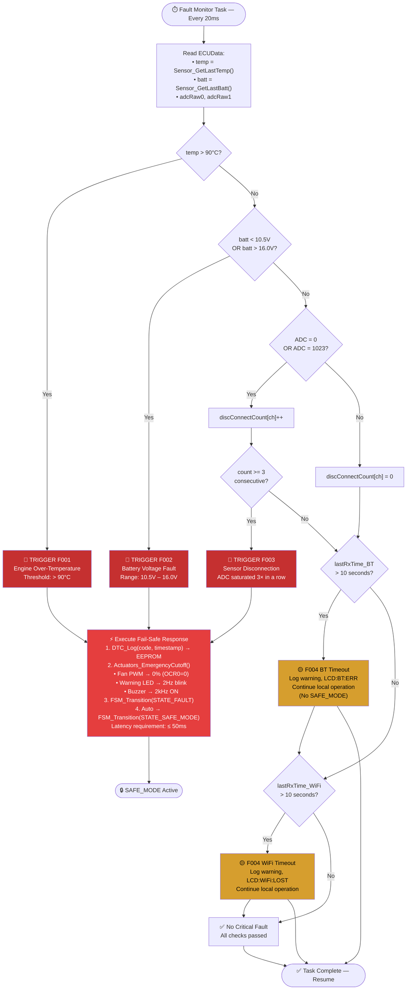

---

## 12. Communication / Deployment Diagram

> Physical deployment of all hardware nodes and their communication links.

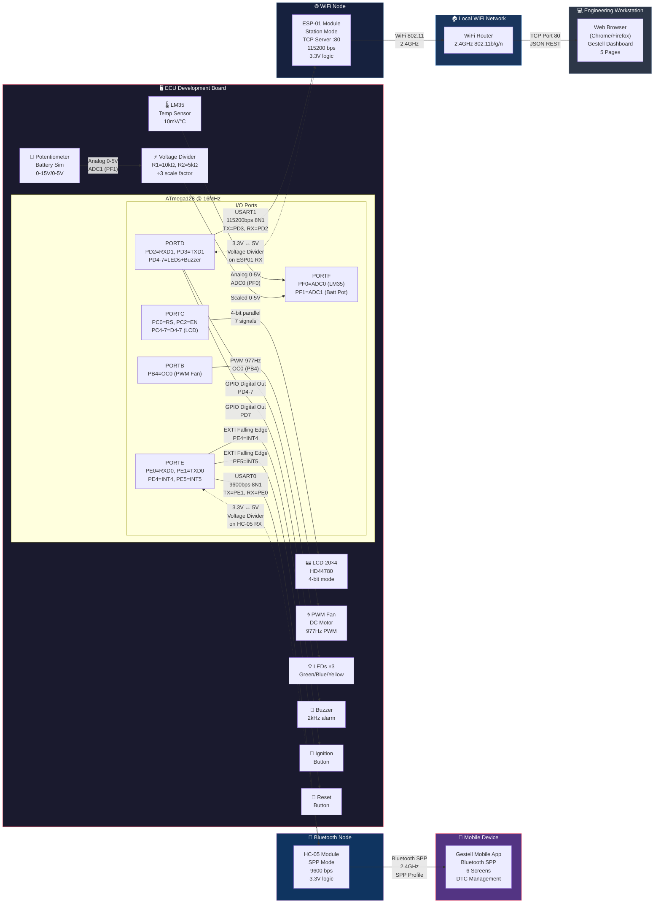

---

## 13. Data Flow Diagram (DFD)

> Shows data flow between all system components — sensors to user interfaces.

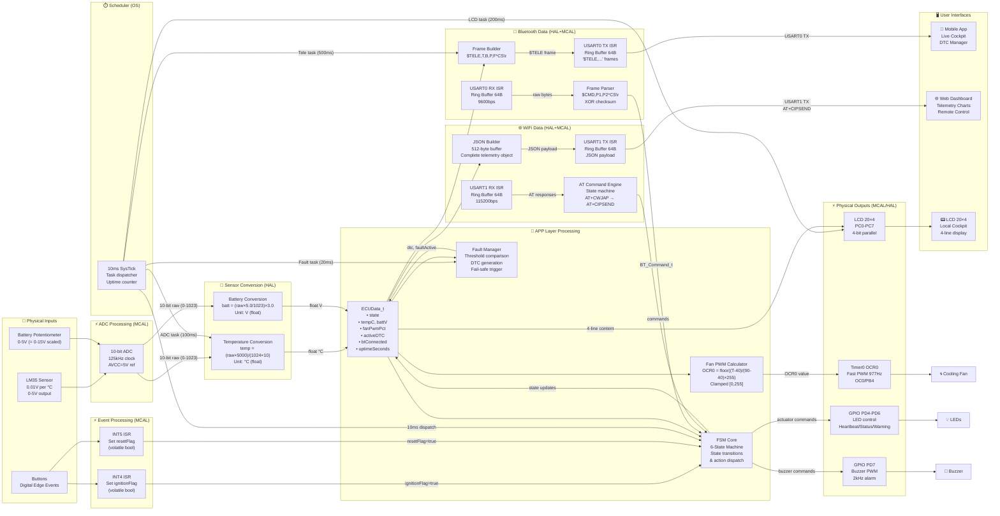

---

## 14. Layer Dependency Diagram

> Strict AUTOSAR-inspired dependency rules — no upward or skip-layer dependencies.

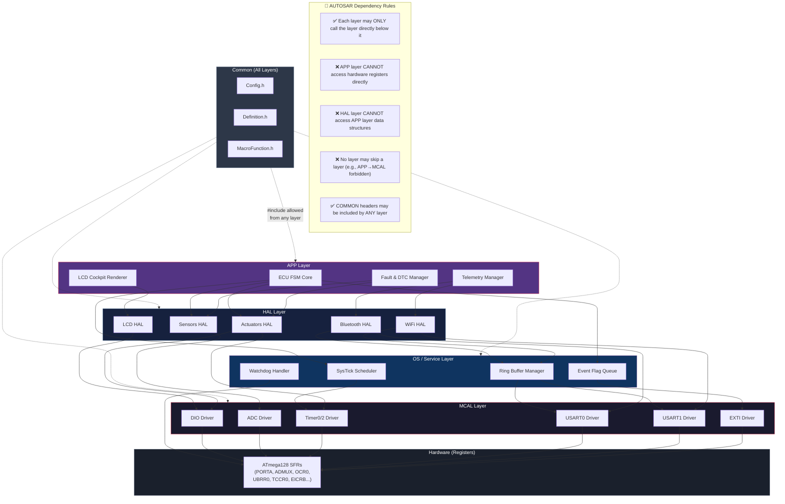

---

## 15. Timing Diagram — Periodic Tasks

> Shows timing relationships of all scheduler tasks and their overlap.

```mermaid
gantt
    title Gestell ECU Scheduler — Periodic Task Timing (one 500ms window)
    dateFormat x
    axisFormat %L ms

    section SysTick
    Timer2 ISR (10ms tick)   :milestone, t0, 0, 0ms
    Timer2 ISR               :milestone, t1, 10, 0ms
    Timer2 ISR               :milestone, t2, 20, 0ms
    Timer2 ISR               :milestone, t3, 30, 0ms
    Timer2 ISR               :milestone, t4, 40, 0ms
    Timer2 ISR               :milestone, t5, 50, 0ms
    Timer2 ISR               :milestone, t6, 100, 0ms
    Timer2 ISR               :milestone, t7, 200, 0ms
    Timer2 ISR               :milestone, t8, 500, 0ms

    section CMD Parser (10ms)
    Parse USART0+1 RX       : active, cmd0, 0, 10ms
    Parse USART0+1 RX       : active, cmd1, 10, 10ms
    Parse USART0+1 RX       : active, cmd2, 20, 10ms
    Parse USART0+1 RX       : active, cmd3, 100, 10ms
    Parse USART0+1 RX       : active, cmd4, 200, 10ms
    Parse USART0+1 RX       : active, cmd5, 490, 10ms

    section Fault Monitor (20ms)
    Check Temp+Batt+Sensor  : crit, f0, 0, 5ms
    Check Temp+Batt+Sensor  : crit, f1, 20, 5ms
    Check Temp+Batt+Sensor  : crit, f2, 40, 5ms
    Check Temp+Batt+Sensor  : crit, f3, 100, 5ms
    Check Temp+Batt+Sensor  : crit, f4, 200, 5ms
    Check Temp+Batt+Sensor  : crit, f5, 480, 5ms

    section ADC Sampling (100ms)
    Read Temp + Batt ADC    : done, adc0, 0, 15ms
    Compute Fan PWM         : done, adc1, 100, 15ms
    Compute Fan PWM         : done, adc2, 200, 15ms
    Compute Fan PWM         : done, adc3, 300, 15ms
    Compute Fan PWM         : done, adc4, 400, 15ms

    section LCD Refresh (200ms)
    Dirty-flag update 4-line : active, lcd0, 15, 8ms
    Dirty-flag update 4-line : active, lcd1, 200, 8ms
    Dirty-flag update 4-line : active, lcd2, 400, 8ms

    section Telemetry (500ms)
    Build BT frame + WiFi JSON + Transmit : active, tele0, 23, 20ms
    Build BT frame + WiFi JSON + Transmit : active, tele1, 500, 20ms
```

---

## 📊 UML Diagram Summary

| # | Diagram Type | Name | Key Information |
|:---:|:---:|:---|:---|
| 1 | Context | System Context | ECU ↔ Driver, Engineer, Mobile App, Web Dashboard |
| 2 | Component | Package/Component | All modules across 4 layers + dependencies |
| 3 | Class | Full System Class | All classes, structs, attributes, methods, relationships |
| 4 | State Machine | ECU FSM | 6 states with entry/exit actions, guards, transitions |
| 5 | Sequence | Boot & Self-Test | Power-on → MCAL init → HAL init → Scheduler → RUN |
| 6 | Sequence | RUN Normal Operation | 500ms scheduler window, all periodic tasks |
| 7 | Sequence | Fault → SAFE_MODE | F001 detection, DTC logging, cutoff, recovery |
| 8 | Sequence | BT Command Processing | Frame RX, XOR validation, command execution |
| 9 | Sequence | WiFi Telemetry | AT init sequence, JSON broadcast, TCP server |
| 10 | Activity | Scheduler Main Loop | Complete cooperative scheduler flow |
| 11 | Activity | Fault Detection Pipeline | F001–F005 detection decision tree |
| 12 | Deployment | Hardware Deployment | All physical nodes and communication links |
| 13 | DFD | Data Flow | Sensor data → ADC → FSM → Actuators → UI |
| 14 | Dependency | Layer Architecture | AUTOSAR strict layer rules enforcement |
| 15 | Timing | Scheduler Timing | Gantt chart of all periodic task timing |

---

*Generated for: Gestell Automotive Mini-ECU — Embedded Part*  
*MCU: ATmega128 AVR @ 16 MHz | Architecture: AUTOSAR 4-Layer | Version: V1/V2/V3*
