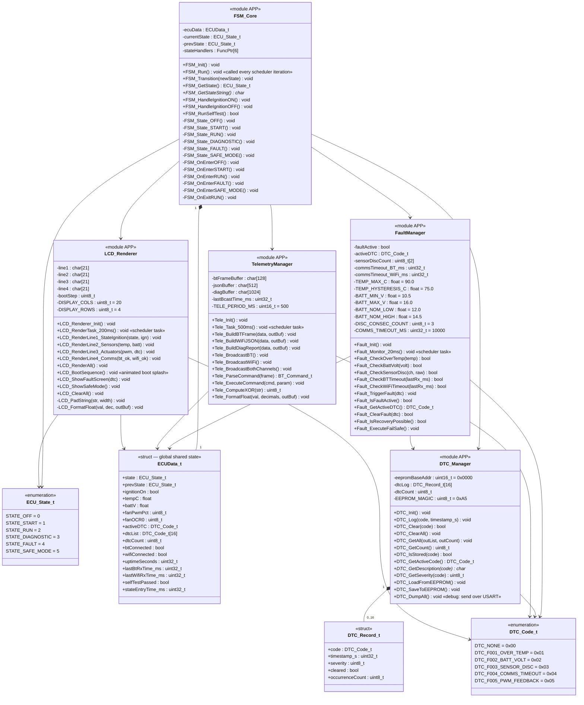
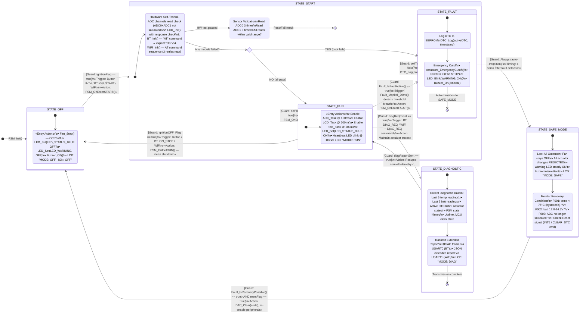
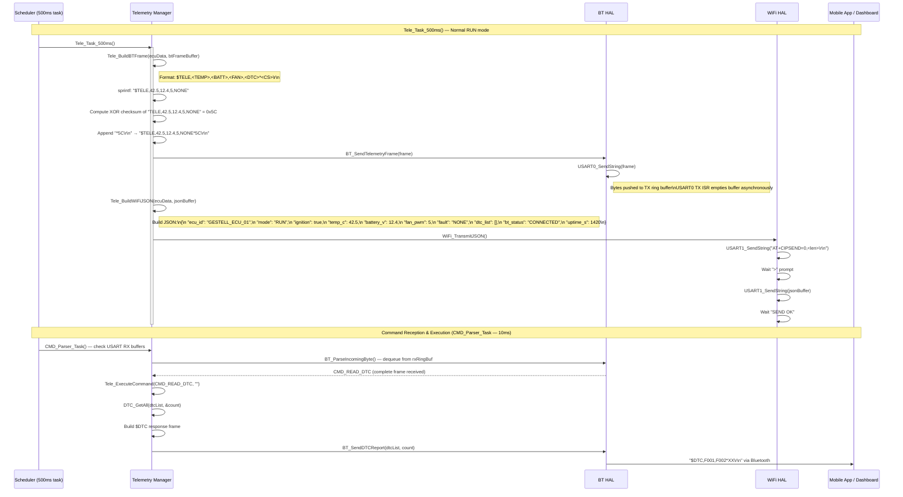
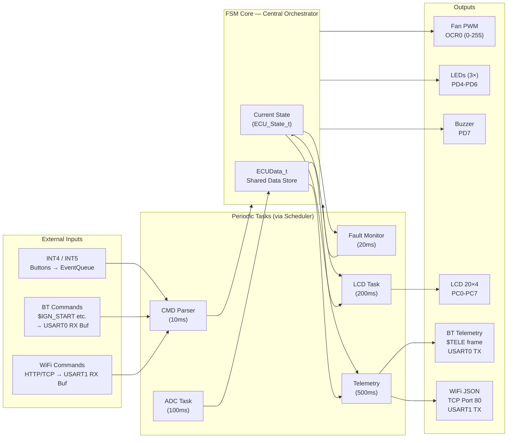

# 🧠 APP Layer — Detailed UML Diagrams

> **Module:** Application Layer (APP)  
> **Modules:** ECU FSM Core · Fault & DTC Manager · Telemetry Manager · LCD Cockpit Renderer  
> **Depends on:** OS + HAL layers  

---

## 1. APP Module Class Diagram

---

## 2. ECU FSM Core — Detailed State Machine with Actions

---

## 3. ECU FSM — State Transition Table (Complete Reference)

| Current State | Event / Guard | Next State | Entry Action |
|:---:|:---|:---:|:---|
| `OFF` | Ignition ON (Button INT4 / BT `IGN_START` / WiFi) | `START` | Begin self-test, LCD: "MODE: START" |
| `START` | Self-test PASS & Sensors Valid | `RUN` | Enable ADC+LCD+Tele tasks, Status LED ON |
| `START` | Self-test FAIL (any module) | `FAULT` | Log boot fault DTC, execute fail-safe |
| `RUN` | `temp > 90°C` | `FAULT` | Log F001, Actuators_EmergencyCutoff() |
| `RUN` | `batt < 10.5V OR batt > 16V` | `FAULT` | Log F002, Actuators_EmergencyCutoff() |
| `RUN` | ADC saturated 3× consecutive | `FAULT` | Log F003, Actuators_EmergencyCutoff() |
| `RUN` | `DIAG_REQ` received (BT or WiFi) | `DIAGNOSTIC` | Collect + transmit extended report |
| `RUN` | Ignition OFF (Button / BT / WiFi) | `OFF` | Disable tasks, clean shutdown |
| `DIAGNOSTIC` | Report transmission complete | `RUN` | Resume normal telemetry broadcast |
| `FAULT` | Automatic (no guard) | `SAFE_MODE` | Lock all actuators within 50ms |
| `SAFE_MODE` | Recovery condition met + Reset signal | `OFF` | Clear DTC, re-enable peripherals, reset counters |

---

## 4. Fault & DTC Manager — Activity Diagram

```mermaid
flowchart TD
    subgraph FAULT_INIT["Fault_Init()"]
        FI1["faultActive = false\nactiveDTC = DTC_NONE\nsensorDiscCount[0] = 0\nsensorDiscCount[1] = 0"]
        FI2["DTC_Init()\nDTC_LoadFromEEPROM()\n(restore DTC history)"]
        FI1 --> FI2
    end

    subgraph FAULT_MON["Fault_Monitor_20ms() — Scheduler Task"]
        FM_START(["Task Entry — every 20ms"]) --> CHECK_F001

        CHECK_F001["Check F001: Over-Temperature\ntemp = ecuData.tempC"]
        CHECK_F001 --> F001_COND{temp > 90°C?}
        F001_COND -- Yes --> TRIG_F001["Fault_TriggerFault(DTC_F001)\n→ Transition to FAULT state"]
        F001_COND -- No --> CHECK_F002

        CHECK_F002["Check F002: Battery Voltage\nbatt = ecuData.battV"]
        CHECK_F002 --> F002_COND{batt < 10.5V\nOR batt > 16V?}
        F002_COND -- Yes --> TRIG_F002["Fault_TriggerFault(DTC_F002)"]
        F002_COND -- No --> CHECK_F003

        CHECK_F003["Check F003: Sensor Disconnection\nraw0 = ADC0 raw, raw1 = ADC1 raw"]
        CHECK_F003 --> F003_COND{raw == 0\nOR raw == 1023?}
        F003_COND -- Yes --> INC_DISC["sensorDiscCount[ch]++"]
        INC_DISC --> DISC3{count >= 3?}
        DISC3 -- Yes --> TRIG_F003["Fault_TriggerFault(DTC_F003)"]
        DISC3 -- No --> CHECK_F004
        F003_COND -- No --> RESET_DISC["sensorDiscCount[ch] = 0"]
        RESET_DISC --> CHECK_F004

        CHECK_F004["Check F004: BT Comms Timeout\nnow - lastBtRxTime_ms"]
        CHECK_F004 --> F004_BT{> 10,000ms?}
        F004_BT -- Yes --> WARN_BT["LCD: 'BT:ERR'\nLog F004 (no SAFE_MODE for F004)\nContinue local operation"]
        F004_BT -- No --> CHECK_F004W

        WARN_BT --> CHECK_F004W
        CHECK_F004W["Check F004: WiFi Comms Timeout\nnow - lastWifiRxTime_ms"]
        CHECK_F004W --> F004_WF{> 10,000ms?}
        F004_WF -- Yes --> WARN_WF["LCD: 'WiFi:LOST'\nLog F004"]
        F004_WF -- No --> FM_DONE

        WARN_WF --> FM_DONE(["Task Complete"])
        TRIG_F001 --> FM_DONE
        TRIG_F002 --> FM_DONE
        TRIG_F003 --> FM_DONE
    end

    subgraph FAILSAFE["Fault_ExecuteFailSafe() — Called by Fault_TriggerFault()"]
        FS1["1. DTC_Log(code, Scheduler_GetUptime_s())"]
        FS2["2. ecuData.activeDTC = code\n   ecuData.faultActive = true"]
        FS3["3. Actuators_EmergencyCutoff()\n   → Timer0_SetDutyCycle(0) ← FAN OFF\n   → LED_Blink(LED_WARNING, 2Hz)\n   → Buzzer_On(2000)"]
        FS4["4. FSM_Transition(STATE_FAULT)\n   → immediately FSM_Transition(STATE_SAFE_MODE)\n   Total latency requirement: ≤ 50ms"]
        FS1 --> FS2 --> FS3 --> FS4
    end

    subgraph DTC_OPS["DTC Manager Operations"]
        D1["DTC_Log(code, ts)\n• Create DTC_Record_t\n• Add to dtcLog[]\n• DTC_SaveToEEPROM()"]
        D2["DTC_Clear(code)\n• Find record by code\n• Set cleared = true\n• DTC_SaveToEEPROM()"]
        D3["DTC_LoadFromEEPROM()\n• Check magic byte 0xA5\n• Read all records\n• Restore dtcCount"]
        D4["EEPROM Layout:\n[0x0000] Magic: 0xA5\n[0x0001] dtcCount\n[0x0002..] DTC_Record_t × 16\nTotal: ~128 bytes"]
    end
```

---

## 5. Telemetry Manager — Frame Building & Broadcast

---

## 6. LCD Cockpit Renderer — Display Layout & Update Flow

```mermaid
flowchart TD
    subgraph LCD_LAYOUT["LCD 20×4 Cockpit Display Layout"]
        ROW1["Line 1 (Row 0): Col 0-19\n'MODE: RUN    IGN: ON '\n Field1: ECU State (cols 0-9)\n Field2: Ignition status (cols 10-19)"]
        ROW2["Line 2 (Row 1): Col 0-19\n'TEMP:42.5C  BAT:12.4V'\n Field1: Engine Temp float 1dp (cols 0-9)\n Field2: Battery Voltage float 1dp (cols 10-19)"]
        ROW3["Line 3 (Row 2): Col 0-19\n'FAN: 5%   FLT: NONE '\n Field1: Fan PWM % integer (cols 0-9)\n Field2: Active DTC code (cols 10-19)"]
        ROW4["Line 4 (Row 3): Col 0-19\n'BT: OK   WiFi:ONLINE'\n Field1: BT link status (cols 0-9)\n Field2: WiFi link status (cols 10-19)"]
    end

    subgraph LCD_RENDER_FLOW["LCD_RenderTask_200ms() — Flow"]
        R1(["Task Entry"]) --> R2["LCD_RenderLine1_StateIgnition(state, ign)\nFormat: 'MODE: %-6s  IGN: %s'\nstate strings: OFF/START/RUN/DIAG/FAULT/SAFE"]
        R2 --> R3["LCD_RenderLine2_Sensors(temp, batt)\nFormat: 'TEMP:%.1fC  BAT:%.1fV'\nPad to 20 chars"]
        R3 --> R4["LCD_RenderLine3_Actuators(pwm, dtc)\nFormat: 'FAN:%-3d%%  FLT:%-4s'\ndtc string: NONE or F001..F005"]
        R4 --> R5["LCD_RenderLine4_Comms(btOk, wifiOk)\nFormat: 'BT:%-4s WiFi:%-6s'\nbt: OK/ERR, wifi: ONLINE/LOST"]
        R5 --> R6["LCD_UpdateDirtyLines()\nOnly write lines where content changed"]
        R6 --> R7(["Task Complete"])
    end

    subgraph BOOT_SEQ["LCD_BootSequence() — Animated Splash"]
        B1["Clear LCD"] --> B2["Line1: 'GESTELL AUTOMOTIVE'"]
        B2 --> B3["Line2: '  ECU v1.0.0      '"]
        B3 --> B4["Line3: '  ATmega128 16MHz '"]
        B4 --> B5["Line4: 'Initializing...   '"]
        B5 --> B6["Wait 500ms"]
        B6 --> B7["Line4: 'BT: Testing...    '"]
        B7 --> B8["Wait 300ms"]
        B8 --> B9["Line4: 'WiFi: Testing...  '"]
        B9 --> B10["Wait 300ms"]
        B10 --> B11["Line4: 'System Ready!     '"]
        B11 --> B12["Wait 500ms → Enter RUN display mode"]
    end

    subgraph FAULT_SCREEN["LCD_ShowFaultScreen(dtc)"]
        F1["Line1: '!!! FAULT DETECTED'"]
        F2["Line2: 'Code: F001        '"]
        F3["Line3: 'Over-Temperature  '"]
        F4["Line4: 'Reset to Continue '"]
    end

    subgraph STATE_STRINGS["LCD State Display Mapping"]
        SS["OFF     → 'OFF   '\nSTART   → 'START '\nRUN     → 'RUN   '\nDIAGNOSTIC → 'DIAG  '\nFAULT   → 'FAULT '\nSAFE_MODE  → 'SAFE  '"]
    end
```

---

## 7. APP Layer — Complete Data Flow

---

*Module: APP Layer | Layer: 4 of 4 | Depends on: OS + HAL layers*
