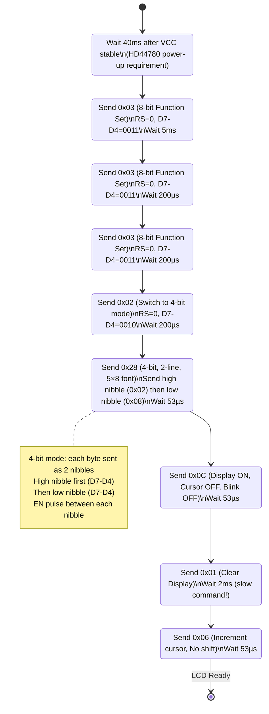
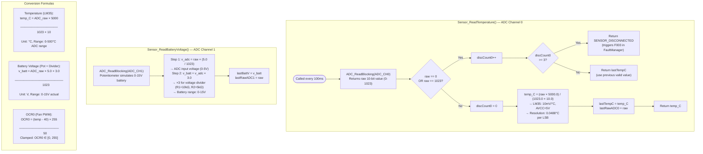
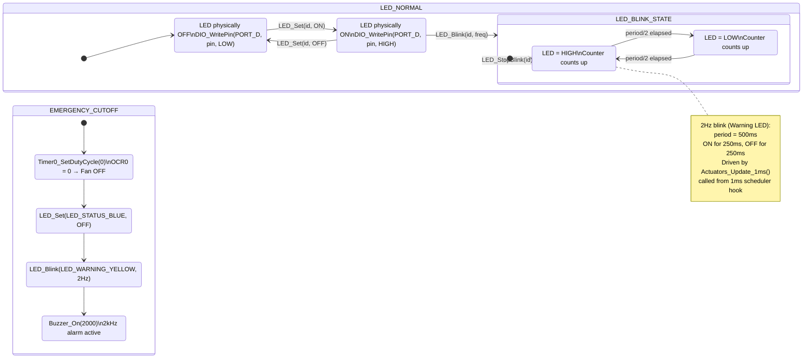
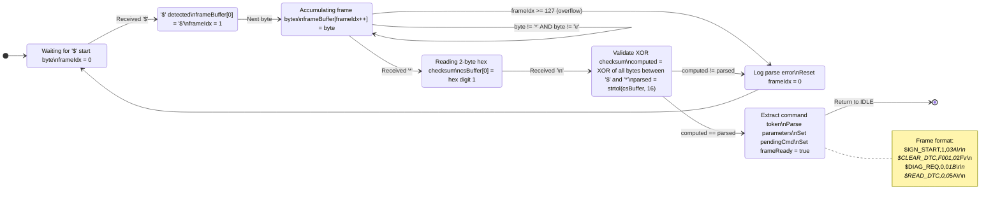
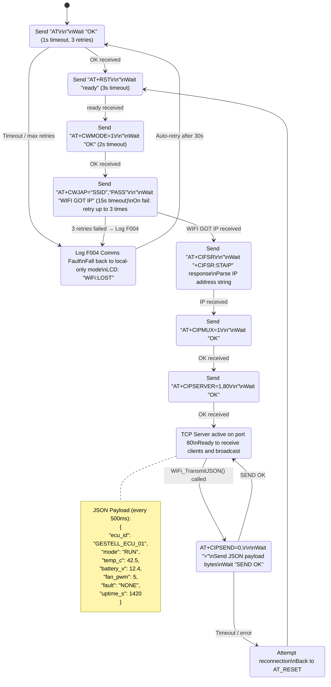
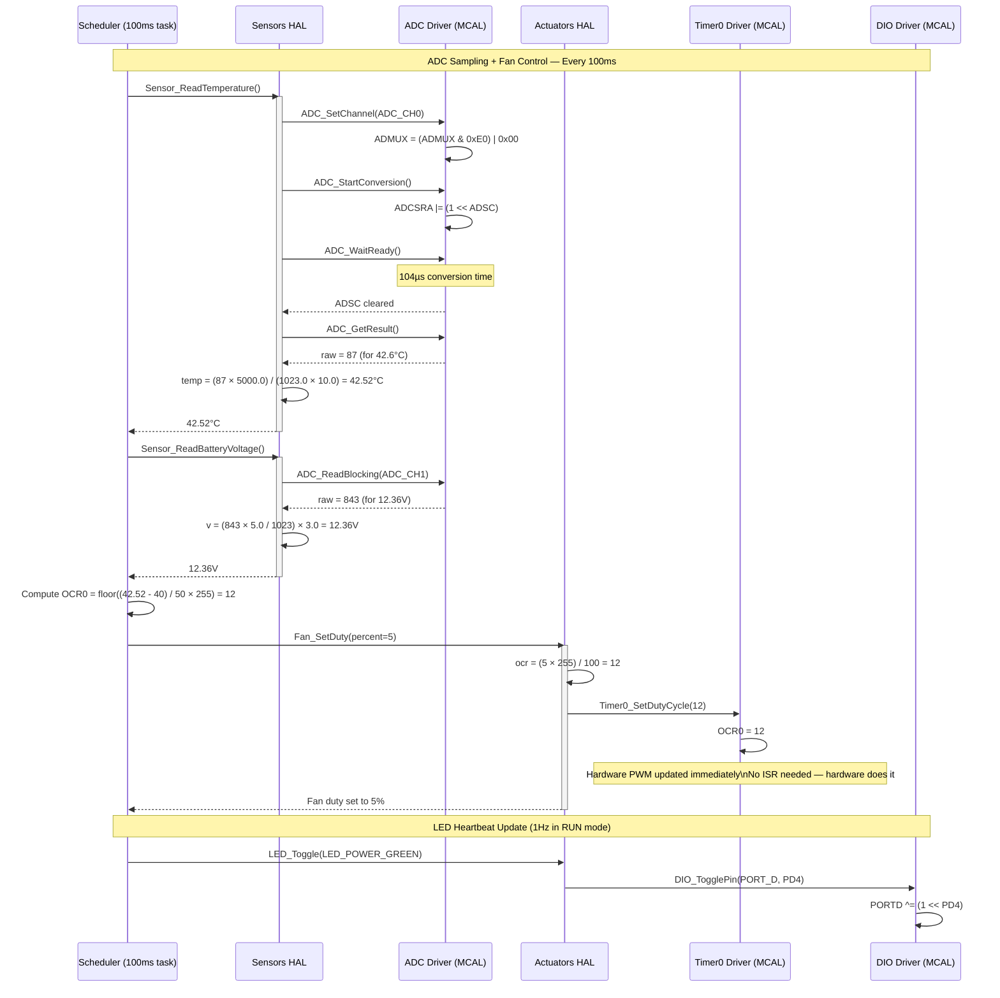

# 🔧 HAL Layer — Detailed UML Diagrams

> **Module:** Hardware Abstraction Layer (HAL)  
> **Modules:** LCD 20×4 · Sensors · Actuators · Bluetooth (HC-05) · WiFi (ESP-01)  
> **Depends on:** MCAL Layer only  

---

## 1. HAL Module Class Diagram

```mermaid
classDiagram
    direction TB

    class LCD_HAL {
        <<module HAL>>
        -RS_PORT : PORT_C
        -RS_PIN : PC0
        -RW_PORT : PORT_C
        -RW_PIN : PC1 «tied LOW»
        -EN_PORT : PORT_C
        -EN_PIN : PC2
        -D4_PIN : PC4
        -D5_PIN : PC5
        -D6_PIN : PC6
        -D7_PIN : PC7
        -lineCache : char[4][21]
        -dirtyFlags : uint8_t «bit per line»
        +LCD_Init() void
        +LCD_Clear() void
        +LCD_Home() void
        +LCD_SetCursor(row, col) void
        +LCD_WriteChar(c) void
        +LCD_WriteString(str) void
        +LCD_WriteCommand(cmd) void
        +LCD_WriteData(data) void
        -LCD_WriteNibble(nibble) void
        -LCD_EnablePulse() void
        -LCD_WaitBusy() void
        +LCD_SetDirty(line) void
        +LCD_ClearDirty(line) void
        +LCD_IsDirty(line) bool
        +LCD_UpdateDirtyLines() void
        +LCD_CreateCustomChar(pos, bitmap) void
    }

    class LCD_Cmd_t {
        <<enumeration>>
        LCD_CMD_CLEAR = 0x01
        LCD_CMD_HOME = 0x02
        LCD_CMD_ENTRY = 0x06
        LCD_CMD_DISPLAY_ON = 0x0C
        LCD_CMD_4BIT_2LINE = 0x28
        LCD_CMD_SETCURSOR = 0x80
    }

    class Sensors_HAL {
        <<module HAL>>
        -ADC_CH_TEMP : uint8_t = 0
        -ADC_CH_BATT : uint8_t = 1
        -TEMP_SCALE : float «V_ref=5.0, 10mV/°C»
        -BATT_DIVIDER : float = 3.0 «×3 scale»
        -lastTempC : float
        -lastBattV : float
        -lastRawADC0 : uint16_t
        -lastRawADC1 : uint16_t
        -discCount0 : uint8_t «consecutive saturated»
        -discCount1 : uint8_t «consecutive saturated»
        +Sensor_Init() void
        +Sensor_ReadTemperature() float
        +Sensor_ReadBatteryVoltage() float
        +Sensor_GetLastTemp() float
        +Sensor_GetLastBatt() float
        +Sensor_ConvertTempADC(raw) float
        +Sensor_ConvertBattADC(raw) float
        +Sensor_IsDisconnected(ch) bool
        +Sensor_GetRawADC(ch) uint16_t
        +Sensor_IncrementDiscCount(ch) void
        +Sensor_ResetDiscCount(ch) void
        +Sensor_GetDiscCount(ch) uint8_t
    }

    class Actuators_HAL {
        <<module HAL>>
        -FAN_PORT : PORT_B
        -FAN_PIN : PB4
        -LED_PWR_PORT : PORT_D
        -LED_PWR_PIN : PD4 «Green Heartbeat»
        -LED_STS_PORT : PORT_D
        -LED_STS_PIN : PD5 «Blue RUN Active»
        -LED_WRN_PORT : PORT_D
        -LED_WRN_PIN : PD6 «Yellow Warning»
        -BUZZER_PORT : PORT_D
        -BUZZER_PIN : PD7
        -fanDutyPct : uint8_t
        -blinkState : uint8_t[3]
        -blinkCounter : uint16_t[3]
        -blinkPeriod_ms : uint16_t[3]
        +Actuators_Init() void
        +Fan_SetDuty(percent) void
        +Fan_Stop() void
        +Fan_GetDutyPct() uint8_t
        +LED_Set(id, state) void
        +LED_Blink(id, freq_hz) void
        +LED_StopBlink(id) void
        +LED_Toggle(id) void
        +Buzzer_On(freq_hz) void
        +Buzzer_Off() void
        +Buzzer_Toggle() void
        +Actuators_EmergencyCutoff() void
        +Actuators_Update_1ms() void «call from scheduler»
    }

    class BT_HAL {
        <<module HAL>>
        -frameBuffer : char[128]
        -frameIdx : uint8_t
        -rxState : BT_RxState_t
        -lastRxTime_ms : uint32_t
        -connected : bool
        -pendingCmd : BT_Command_t
        -cmdParam : char[32]
        +BT_Init() void
        +BT_SendByte(byte) void
        +BT_SendString(str) void
        +BT_SendTelemetryFrame(temp, batt, pwm, dtc) void
        +BT_SendDTCReport(dtcList, count) void
        +BT_SendDiagReport(report) void
        +BT_SendACK(cmd) void
        +BT_ParseIncomingByte(byte) bool
        +BT_GetParsedCommand() BT_Command_t
        +BT_GetCommandParam() char*
        +BT_ComputeXORChecksum(str) uint8_t
        +BT_ValidateChecksum(frame) bool
        +BT_IsConnected() bool
        +BT_CheckTimeout() bool
        +BT_UpdateRxTime() void
        +BT_ResetParser() void
    }

    class BT_RxState_t {
        <<enumeration>>
        BT_RX_IDLE = 0
        BT_RX_START = 1 «got $»
        BT_RX_BODY = 2
        BT_RX_CHECKSUM = 3
        BT_RX_COMPLETE = 4
        BT_RX_ERROR = 5
    }

    class WiFi_HAL {
        <<module HAL>>
        -AT_RESPONSE_TIMEOUT : uint16_t = 5000ms
        -atBuffer : char[256]
        -atIdx : uint16_t
        -jsonBuffer : char[512]
        -retryCount : uint8_t
        -connected : bool
        -tcpClientId : uint8_t = 0
        -wifiState : WiFi_State_t
        -lastRxTime_ms : uint32_t
        +WiFi_Init() void
        +WiFi_SendAT(cmd) void
        +WiFi_WaitResponse(expected, timeout) bool
        +WiFi_JoinNetwork(ssid, pass) bool
        +WiFi_GetIP() char*
        +WiFi_StartTCPServer(port) bool
        +WiFi_BuildJSONPayload(ecuData) void
        +WiFi_TransmitJSON() bool
        +WiFi_Reconnect() bool
        +WiFi_IsConnected() bool
        +WiFi_CheckTimeout() bool
        +WiFi_ParseATResponse(byte) void
        +WiFi_GetRetryCount() uint8_t
        +WiFi_ResetState() void
    }

    class WiFi_State_t {
        <<enumeration>>
        WIFI_IDLE = 0
        WIFI_AT_TEST = 1
        WIFI_RESET = 2
        WIFI_SET_MODE = 3
        WIFI_JOIN_AP = 4
        WIFI_GET_IP = 5
        WIFI_MULTI_CONN = 6
        WIFI_TCP_SERVER = 7
        WIFI_CONNECTED = 8
        WIFI_ERROR = 9
    }

    %% Relationships
    LCD_HAL --> LCD_Cmd_t
    Sensors_HAL --> ADC_Channel_t
    Actuators_HAL --> LED_ID_t
    BT_HAL --> BT_RxState_t
    BT_HAL --> BT_Command_t
    WiFi_HAL --> WiFi_State_t
```

---

## 2. LCD HAL — 4-bit HD44780 Initialization State Machine

---

## 3. LCD HAL — Dirty-Flag Update Mechanism

```mermaid
flowchart TD
    subgraph LCD_RENDER["LCD_UpdateDirtyLines() — Every 200ms"]
        START(["Entry"]) --> CHECK_L1{Line 1\nDirty?}
        CHECK_L1 -- Yes --> WRITE_L1["LCD_SetCursor(0,0)\nLCD_WriteString(newLine1)\nClearDirty(0)"]
        CHECK_L1 -- No --> CHECK_L2
        WRITE_L1 --> CHECK_L2

        CHECK_L2{Line 2\nDirty?} -- Yes --> WRITE_L2["LCD_SetCursor(1,0)\nLCD_WriteString(newLine2)\nClearDirty(1)"]
        CHECK_L2 -- No --> CHECK_L3
        WRITE_L2 --> CHECK_L3

        CHECK_L3{Line 3\nDirty?} -- Yes --> WRITE_L3["LCD_SetCursor(2,0)\nLCD_WriteString(newLine3)\nClearDirty(2)"]
        CHECK_L3 -- No --> CHECK_L4
        WRITE_L3 --> CHECK_L4

        CHECK_L4{Line 4\nDirty?} -- Yes --> WRITE_L4["LCD_SetCursor(3,0)\nLCD_WriteString(newLine4)\nClearDirty(3)"]
        CHECK_L4 -- No --> DONE
        WRITE_L4 --> DONE(["Exit"])
    end

    subgraph DIRTY_SET["When Dirty Flag is Set"]
        COMPARE["Renderer compares new content\nwith lineCache[i]"]
        DIFFERENT{Content\nChanged?}
        SET_DIRTY["LCD_SetDirty(line)\ndirtyFlags |= (1 << line)\nUpdate lineCache"]
        COMPARE --> DIFFERENT
        DIFFERENT -- Yes --> SET_DIRTY
        DIFFERENT -- No --> SKIP["Skip — no LCD write"]
    end

    subgraph NIBBLE_WRITE["LCD_WriteChar(c) — 4-bit Write Sequence"]
        N1["Set RS = HIGH (data mode)"]
        N2["Write HIGH nibble (bits 7-4)\nSET/CLR PC4-PC7 based on bits"]
        N3["LCD_EnablePulse()\nEN=HIGH → wait 1µs → EN=LOW"]
        N4["Write LOW nibble (bits 3-0)\nSET/CLR PC4-PC7 based on bits"]
        N5["LCD_EnablePulse()\nEN=HIGH → wait 1µs → EN=LOW"]
        N6["Wait 53µs (char write settle time)"]
        N1 --> N2 --> N3 --> N4 --> N5 --> N6
    end
```

---

## 4. Sensors HAL — Data Conversion & Disconnect Detection

---

## 5. Actuators HAL — LED Blink & Emergency Cutoff

---

## 6. Bluetooth HAL — Frame Parser State Machine

---

## 7. WiFi HAL — AT Command Engine State Machine

---

## 8. HAL Layer — Sequence: Full Sensor-to-Actuator Control Loop

---

*Module: HAL | Layer: 2 of 4 | Depends on: MCAL*
