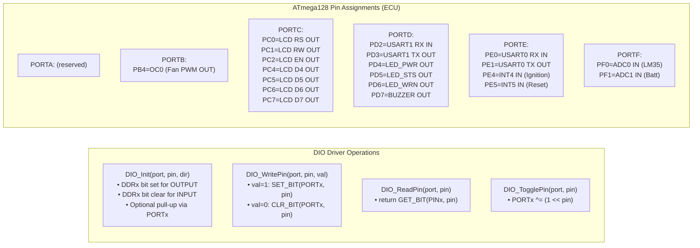
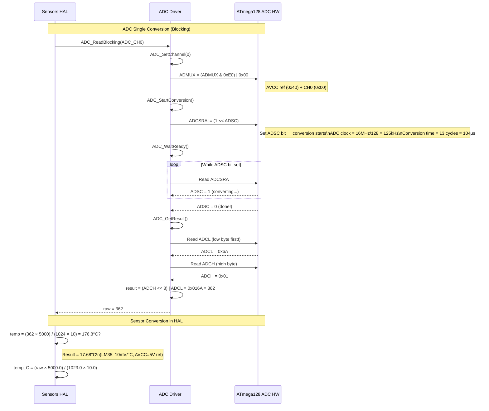
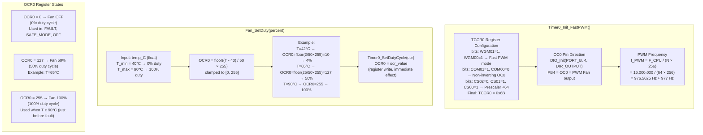
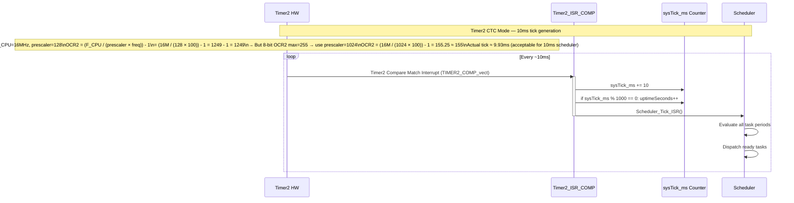
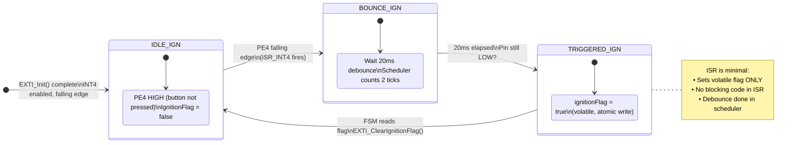

# 🔌 MCAL Layer — Detailed UML Diagrams

> **Module:** Microcontroller Abstraction Layer (MCAL)  
> **Target:** ATmega128 AVR @ 16 MHz  
> **Modules:** DIO · ADC · Timer0/2 (PWM + SysTick) · USART0 · USART1 · EXTI  

---

## 1. MCAL Module Class Diagram

```mermaid
classDiagram
    direction TB

    class DIO_Driver {
        <<module MCAL>>
        -DDRA : reg8 «Output Direction»
        -DDRB : reg8 «Output Direction»
        -DDRC : reg8 «Output Direction»
        -DDRD : reg8 «Output Direction»
        -DDRE : reg8 «Output Direction»
        -DDRF : reg8 «Output Direction»
        -PORTA : reg8 «Output Data»
        -PORTB : reg8 «Output Data»
        -PORTC : reg8 «Output Data»
        -PORTD : reg8 «Output Data»
        -PORTE : reg8 «Output Data»
        -PORTF : reg8 «Output Data»
        -PINA : reg8 «Input Read»
        -PINB : reg8 «Input Read»
        +DIO_Init(port, pin, dir) void
        +DIO_WritePin(port, pin, val) void
        +DIO_ReadPin(port, pin) uint8_t
        +DIO_TogglePin(port, pin) void
        +DIO_WritePort(port, val) void
        +DIO_ReadPort(port) uint8_t
        +DIO_SetPinHigh(port, pin) void
        +DIO_SetPinLow(port, pin) void
    }

    class DIO_Port_t {
        <<enumeration>>
        PORT_A = 0
        PORT_B = 1
        PORT_C = 2
        PORT_D = 3
        PORT_E = 4
        PORT_F = 5
        PORT_G = 6
    }

    class DIO_Dir_t {
        <<enumeration>>
        DIR_INPUT = 0
        DIR_OUTPUT = 1
    }

    class ADC_Driver {
        <<module MCAL>>
        -ADMUX : reg8 «0x40 = AVCC ref, ch0»
        -ADCSRA : reg8 «0x87 = enable+start+prescaler128»
        -ADCL : reg8 «low byte of result»
        -ADCH : reg8 «high byte of result»
        -conversionDone : volatile bool
        +ADC_Init() void
        +ADC_SetChannel(ch) void
        +ADC_StartConversion() void
        +ADC_WaitReady() void
        +ADC_GetResult() uint16_t
        +ADC_ReadBlocking(ch) uint16_t
        +ADC_SetReference(ref) void
        +ADC_Enable() void
        +ADC_Disable() void
    }

    class ADC_Channel_t {
        <<enumeration>>
        ADC_CH0 = 0 «LM35 Temp»
        ADC_CH1 = 1 «Battery Pot»
        ADC_CH2 = 2
        ADC_CH3 = 3
        ADC_CH4 = 4
        ADC_CH5 = 5
        ADC_CH6 = 6
        ADC_CH7 = 7
    }

    class ADC_Ref_t {
        <<enumeration>>
        ADC_REF_AREF = 0x00
        ADC_REF_AVCC = 0x40 «default»
        ADC_REF_INT = 0xC0
    }

    class Timer0_Driver {
        <<module MCAL — PWM>>
        -TCCR0 : reg8 «0x6B = FastPWM, OC0 non-inv, presc÷64»
        -OCR0  : reg8 «Compare Output register 0»
        -TCNT0 : reg8 «Timer Counter»
        -TIMSK : reg8 «Timer Interrupt Mask»
        +Timer0_Init_FastPWM() void
        +Timer0_SetDutyCycle(ocr) void
        +Timer0_Stop() void
        +Timer0_Enable_OVF_IRQ() void
        +Timer0_GetDuty() uint8_t
        +Timer0_GetFrequency_Hz() uint16_t
    }

    class Timer2_Driver {
        <<module MCAL — SysTick>>
        -TCCR2 : reg8 «CTC mode, prescaler»
        -OCR2  : reg8 «Compare value for 10ms»
        -TCNT2 : reg8 «Timer counter»
        -sysTick_ms : volatile uint32_t
        +Timer2_Init_CTC_10ms() void
        +Timer2_GetTick_ms() uint32_t
        +Timer2_ISR_COMP() void «ISR»
        +Timer2_DelayMs(ms) void
        +Timer2_ResetTick() void
    }

    class USART0_Driver {
        <<module MCAL — Bluetooth>>
        -UBRRH0 : reg8 «0x00»
        -UBRRL0 : reg8 «0x67 = UBRR=103 for 9600bps»
        -UCSR0A : reg8 «0x00 normal speed»
        -UCSR0B : reg8 «0xD8 = RX+TX IRQ, RXen, TXen»
        -UCSR0C : reg8 «0x86 = 8N1»
        -rxRingBuf : RingBuffer_t «64 bytes»
        -txRingBuf : RingBuffer_t «64 bytes»
        +USART0_Init() void
        +USART0_SendByte(byte) void
        +USART0_SendString(str) void
        +USART0_SendBuffer(buf, len) void
        +USART0_ReceiveByte() uint8_t
        +USART0_DataAvailable() bool
        +USART0_TxReady() bool
        +ISR_USART0_RXC() void «ISR»
        +ISR_USART0_TXC() void «ISR»
        +USART0_FlushRX() void
    }

    class USART1_Driver {
        <<module MCAL — WiFi>>
        -UBRRH1 : reg8 «0x00»
        -UBRRL1 : reg8 «0x08 = UBRR=8 for 115200bps»
        -UCSR1B : reg8 «0xD8 = RX+TX IRQ, RXen, TXen»
        -UCSR1C : reg8 «0x86 = 8N1»
        -rxRingBuf : RingBuffer_t «64 bytes»
        -txRingBuf : RingBuffer_t «64 bytes»
        +USART1_Init() void
        +USART1_SendByte(byte) void
        +USART1_SendString(str) void
        +USART1_SendBuffer(buf, len) void
        +USART1_ReceiveByte() uint8_t
        +USART1_DataAvailable() bool
        +ISR_USART1_RXC() void «ISR»
        +ISR_USART1_TXC() void «ISR»
        +USART1_FlushRX() void
    }

    class RingBuffer_t {
        <<struct — shared>>
        +buffer : uint8_t[64]
        +head : volatile uint8_t
        +tail : volatile uint8_t
        +count : volatile uint8_t
        +capacity : uint8_t = 64
    }

    class EXTI_Driver {
        <<module MCAL — Interrupts>>
        -EICRB : reg8 «INT4,INT5 config = falling edge»
        -EIMSK : reg8 «Enable INT4, INT5»
        -ignitionFlag : volatile bool
        -resetFlag : volatile bool
        -ignDebounce_ms : uint16_t = 20
        -rstDebounce_ms : uint16_t = 20
        +EXTI_Init() void
        +EXTI_EnableINT4() void
        +EXTI_EnableINT5() void
        +EXTI_DisableINT4() void
        +EXTI_DisableINT5() void
        +EXTI_GetIgnitionFlag() bool
        +EXTI_GetResetFlag() bool
        +EXTI_ClearIgnitionFlag() void
        +EXTI_ClearResetFlag() void
        +ISR_INT4_Handler() void «ISR»
        +ISR_INT5_Handler() void «ISR»
    }

    %% Relationships
    DIO_Driver --> DIO_Port_t
    DIO_Driver --> DIO_Dir_t
    ADC_Driver --> ADC_Channel_t
    ADC_Driver --> ADC_Ref_t
    USART0_Driver "1" *-- "2" RingBuffer_t
    USART1_Driver "1" *-- "2" RingBuffer_t
    Timer0_Driver ..> Timer2_Driver : «independent»
```

---

## 2. DIO Driver — State & Operation Diagram

---

## 3. ADC Driver — Conversion Sequence

---

## 4. Timer0 PWM Driver — Configuration & Operation

---

## 5. Timer2 SysTick — Interrupt-Driven Scheduler Timer

---

## 6. USART0 Driver — Interrupt-Driven Ring Buffer Architecture

```mermaid
flowchart TB
    subgraph TX_PATH["📤 TX Path (ATmega128 → HC-05)"]
        TX_APP["APP/HAL calls\nUSART0_SendString(str)"]
        TX_PUSH["Loop: RingBuf_Push(txBuf, byte)\nfor each char in string"]
        TX_KICK["Enable UDRIE0 interrupt\nUCSR0B |= (1 << UDRIE0)"]
        TX_ISR["ISR: USART0_UDRE_vect\n(Runs when TX register empty)"]
        TX_POP["RingBuf_Pop(txBuf, &byte)"]
        TX_REG["UDR0 = byte\n(load to TX shift register)"]
        TX_EMPTY{TX Buffer\nEmpty?}
        TX_DIS["Disable UDRIE0\nUCSR0B &= ~(1<<UDRIE0)"]
        TX_HW["HC-05 receives byte\nover PE1/TXD0"]

        TX_APP --> TX_PUSH --> TX_KICK
        TX_KICK --> TX_ISR --> TX_POP --> TX_REG --> TX_EMPTY
        TX_EMPTY -- No --> TX_ISR
        TX_EMPTY -- Yes --> TX_DIS
        TX_REG --> TX_HW
    end

    subgraph RX_PATH["📥 RX Path (HC-05 → ATmega128)"]
        RX_HW["HC-05 sends byte\nover PE0/RXD0"]
        RX_ISR["ISR: USART0_RXC_vect\n(Runs on every byte received)"]
        RX_READ["byte = UDR0\n(read clears interrupt)"]
        RX_PUSH["RingBuf_Push(rxBuf, byte)"]
        RX_NOTE["64-byte circular buffer\nNo data loss at 9600bps"]

        RX_HW --> RX_ISR --> RX_READ --> RX_PUSH --> RX_NOTE
    end

    subgraph CMD_PARSE["📋 Command Parser (10ms task)"]
        POLL["USART0_DataAvailable()?\nRingBuf_IsEmpty(rxBuf) == false"]
        DEQUEUE["USART0_ReceiveByte()\nRingBuf_Pop(rxBuf, &byte)"]
        BUILD["Assemble frame until \\r\\n\nframeBuffer[idx++] = byte"]
        COMPLETE{Frame\ncomplete?}
        PARSE["BT_ParseFrame(frameBuffer)\nExtract CMD + params + checksum"]

        POLL --> DEQUEUE --> BUILD --> COMPLETE
        COMPLETE -- No --> POLL
        COMPLETE -- Yes --> PARSE
    end
```

---

## 7. EXTI Driver — Interrupt & Debounce Logic

---

*Module: MCAL | Layer: 1 of 4 | Target: ATmega128 AVR*
