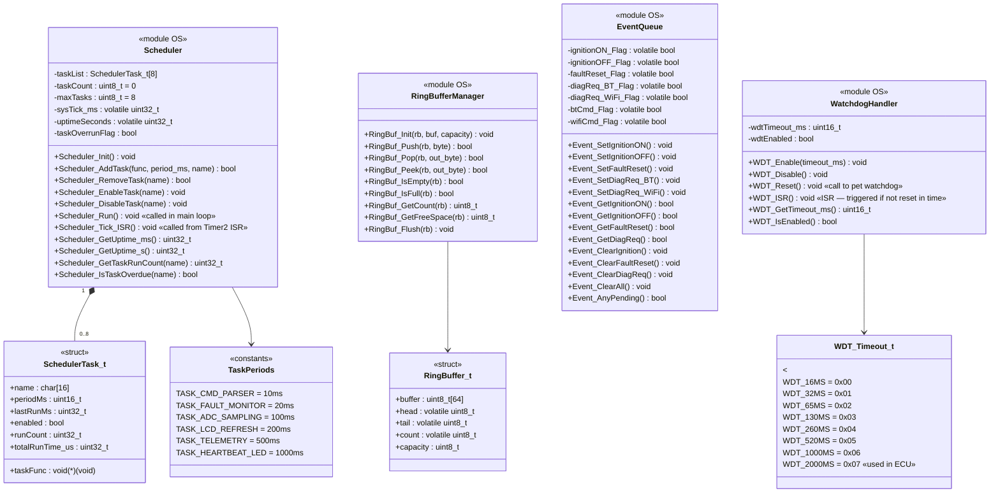
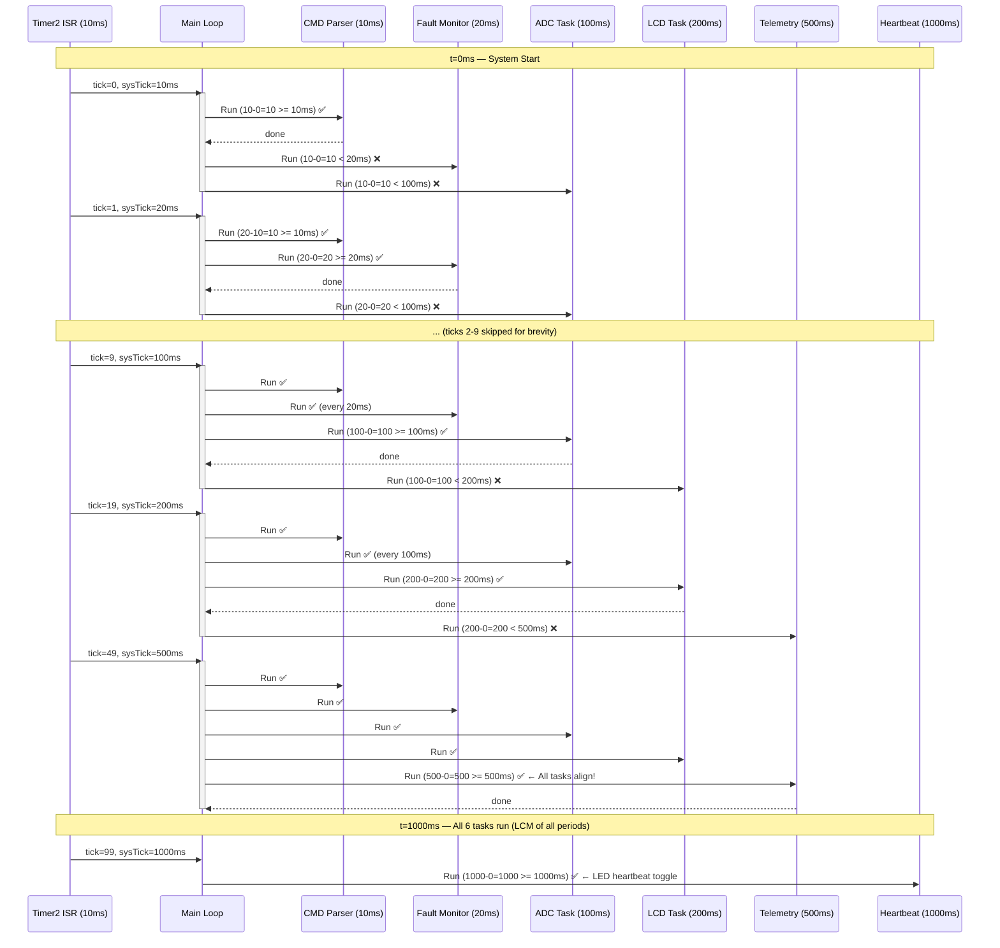
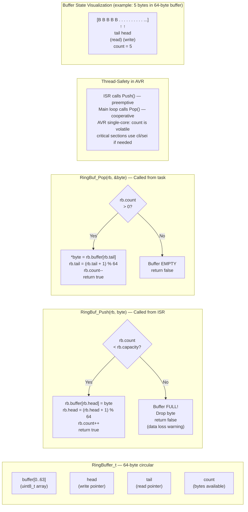
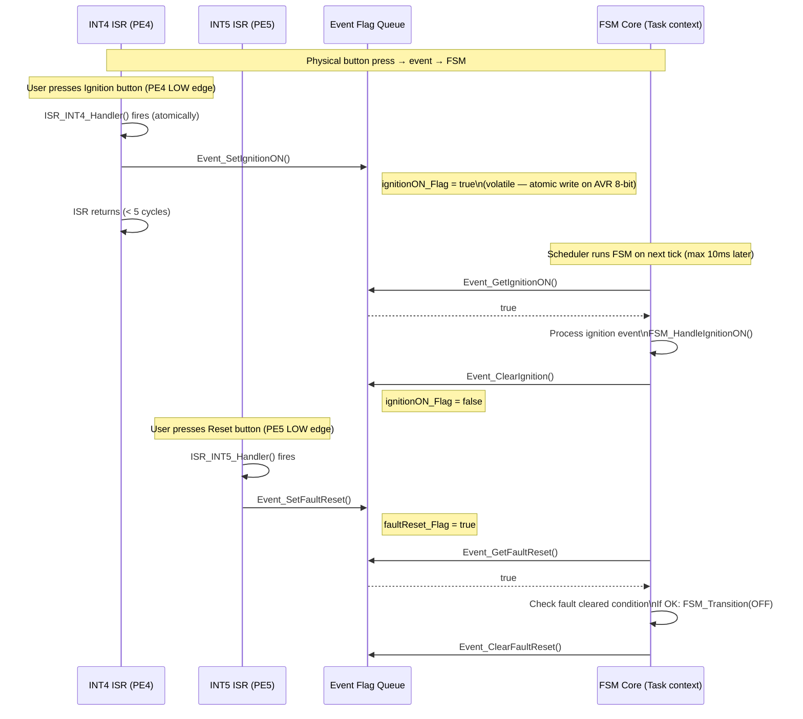

# ⚡ OS / Service Layer — Detailed UML Diagrams

> **Module:** OS / Service Layer  
> **Modules:** SysTick Cooperative Scheduler · Ring Buffer Manager · Event Flag Queue · Watchdog Handler  
> **Depends on:** HAL Layer (for Timer2)  

---

## 1. OS Module Class Diagram



---

## 2. Scheduler — Task Registration & Dispatch Activity Diagram

```mermaid
flowchart TD
    subgraph SCHEDULER_INIT["Scheduler_Init() — Called Once at Startup"]
        I1["taskCount = 0\nsysTick_ms = 0\nuptimeSeconds = 0"]
        I2["Scheduler_AddTask(CMD_Parser_Task, 10, 'CMD')"]
        I3["Scheduler_AddTask(Fault_Monitor_Task, 20, 'FAULT')"]
        I4["Scheduler_AddTask(ADC_Sampling_Task, 100, 'ADC')"]
        I5["Scheduler_AddTask(LCD_Refresh_Task, 200, 'LCD')"]
        I6["Scheduler_AddTask(Telemetry_Task, 500, 'TELE')"]
        I7["Scheduler_AddTask(Heartbeat_Task, 1000, 'HB')"]
        I8["Timer2_Init_CTC_10ms()\nEnable Timer2 Compare interrupt"]
        I1 --> I2 --> I3 --> I4 --> I5 --> I6 --> I7 --> I8
    end

    subgraph TICK_ISR["Timer2_ISR_COMP() — Every ~10ms (ISR context)"]
        T1["sysTick_ms += 10"]
        T2["if sysTick_ms % 1000 == 0:\n  uptimeSeconds++"]
        T3["WDT_Reset()\n(pet watchdog every tick)"]
        T4["ISR exits — returns to main loop"]
        T1 --> T2 --> T3 --> T4
    end

    subgraph SCHEDULER_RUN["Scheduler_Run() — Called in Main Loop (forever)"]
        R1["now = sysTick_ms"]
        R2["i = 0"]
        R3{i < taskCount?}
        R4["task = taskList[i]"]
        R5{task.enabled\nAND\n(now - task.lastRunMs)\n>= task.periodMs?}
        R6["task.taskFunc()\ntask.lastRunMs = now\ntask.runCount++"]
        R7["i++"]
        R8["Repeat forever"]

        R1 --> R2 --> R3
        R3 -- Yes --> R4 --> R5
        R5 -- Yes --> R6 --> R7 --> R3
        R5 -- No --> R7
        R3 -- No --> R8 --> R1
    end
```

---

## 3. Scheduler — Task Execution Timeline



---

## 4. Ring Buffer Manager — Push/Pop Operations



---

## 5. Event Flag Queue — ISR to Task Communication



---

## 6. Watchdog Handler — Operation & Trigger Sequence

```mermaid
flowchart TD
    subgraph WDT_NORMAL["Normal Operation — WDT Reset Every 10ms"]
        W1(["System Running"]) --> W2["Timer2 ISR fires every 10ms"]
        W2 --> W3["Scheduler_Tick_ISR() called"]
        W3 --> W4["WDT_Reset() — WDTCR |= (1<<WDCE) ... wdr instruction"]
        W4 --> W5["Watchdog counter restarted (2s window)"]
        W5 --> W2
    end

    subgraph WDT_TRIGGER["Watchdog Trigger — Scheduler Stuck (> 2s without reset)"]
        X1["Scheduler stuck / main loop blocked\nTimer2 ISR not executing"]
        X2["WDT counter counts to 2000ms timeout"]
        X3["WDT fires: MCUSR |= (1<<WDRF)\nSystem RESET"]
        X4["Power-on Reset sequence restarts\nAll drivers reinitialize"]
        X5["FSM starts at STATE_OFF\nDTC F005 logged if detected"]
        X1 --> X2 --> X3 --> X4 --> X5
    end

    subgraph WDT_CONFIG["WDT_Enable(2000ms)"]
        C1["Disable interrupts: cli()"]
        C2["Enable WDT change: WDTCR |= (1<<WDCE) | (1<<WDE)"]
        C3["Set timeout: WDTCR = (1<<WDE) | WDT_2000MS (0x07)"]
        C4["Enable interrupts: sei()"]
        C1 --> C2 --> C3 --> C4
    end
```



---

*Module: OS / Service Layer | Layer: 3 of 4 | Depends on: HAL (Timer2)*
